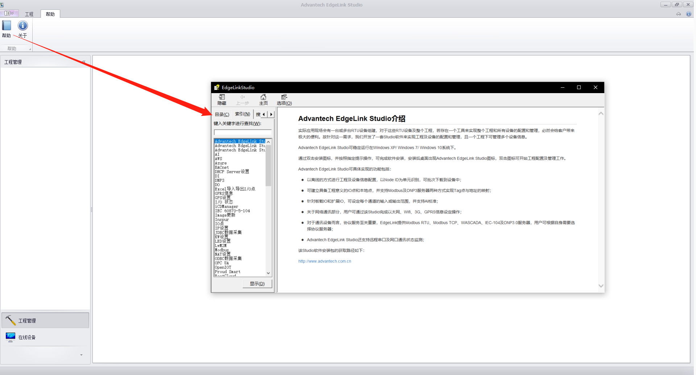

# 研华网关 ECU1051 ECU251

相关链接：

[第三方淘宝店](https://item.taobao.com/item.htm?id=643473330450)

微信搜研华商城

[ECU1051技术资料区域](https://www.advantech.com.cn/search/?q=ESRP-PCS-ECU1051&st=support)

[研华配置网关配置软件 EdgeLinkStudio下载处](https://www.advantech.com.cn/search/?q=studio&st=support&sst=Utility)

[Ecu1051 固件下载位置](https://www.advantech.com.cn/search/?q=ecu1051%20edgelink&st=support&sst=Firmware)

[Ecu 1251固件下载位置](https://www.advantech.com.cn/search/?q=ecu1251%20edgelink&st=support&sst=Firmware)

[驱动配置说明书](https://www.advantech.com.cn/support/details/manual?id=1-1VGKZI5)

## 初始密码
网页管理：账号admin，密码8个0
ssh远程：账号root，密码空

## 说明书

## 松下plc  内存区与modbus映射关系

## 连接mqtt服务器

## 坑

### 不配置时间服务器，时间不对

### Tag的时间比当前时间慢

可能是因为DataHub后台处理数据缓慢，造成的，也有可能是时间服务器没配置。

### 485配置内存区，有时需要加1

### 没有天线，4G上网不顶用

### 修改IP，需要下载配置，重启后才不会变

## 相关

### 固件搜索方法

研华官网输入ecu1251 edgelink

