# 网络设置参考

**FANUC CNC架设数据服务器的参数设定**

**一、FTP通讯参数的设定**

1）I/O=5，（NO.20=5）

2）按下“SYSTEM”键，然后按“+”软键，直到如下画面：

[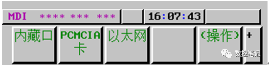](https://cdn.sk1z.com/wp-content/uploads/2022/07/3-1656676224.png)

3）按下“以太网”出现如下画面：

[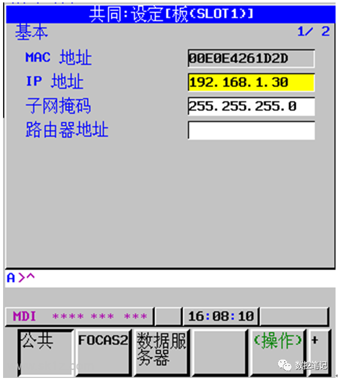](https://cdn.sk1z.com/wp-content/uploads/2022/07/0-1656676224.png)

之后按下“公共”键，MAC地址不需要输入数据，有CNC自动产生，在IP地址输入自定义的机床本地地址，形如“192.168.1.X”，X取值1~254，子网掩码输入“255.255.255.0”。

4）按下“FOCAS2”键，出现下列画面，并输入如下图所示的数据，不要改变：

[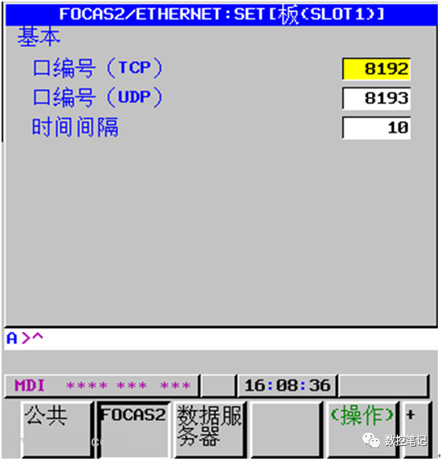](https://cdn.sk1z.com/wp-content/uploads/2022/07/2-1656676224.png)

5）按下“数据服务器”，出现下列画面：

[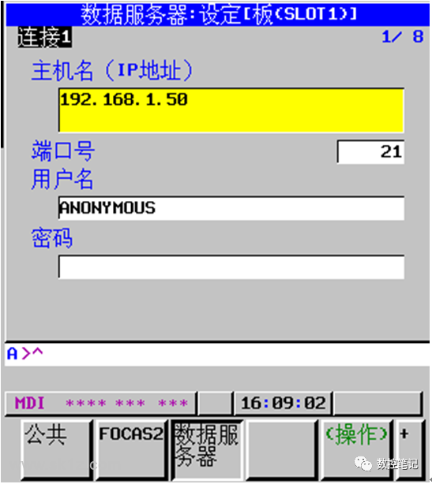](https://cdn.sk1z.com/wp-content/uploads/2022/07/3-1656676225.png)

一台机床最多可以连接四台主机，此处以主机1设定为例说明，其它设置类似。

一定要注意“主机名（IP地址）”的输入，此处IP地址指定了作为FTP服务器的远程计算机地址，一般设定为“192.168.1.X”，X取值0~255，。在远程计算机的IP地址设定时，一定要和此处的IP地址保持一致，千万不能搞错。

端口号输入“21”，不能改变。

用户名可以随意，但是远程FTP服务器软件在创建用户时，一定要包涵这个用户名，否则机床在登录这个FTP服务器时将无法登录。例如，此处用户名为“ANONYMOUS”，FTP服务器在创建用户时，一定要创建一个ANONYMOUS。

 

**一）FTP工作方式的设定**

1）按下“数据服务器软键”后，按下“操作”软键，出现如下画面：

[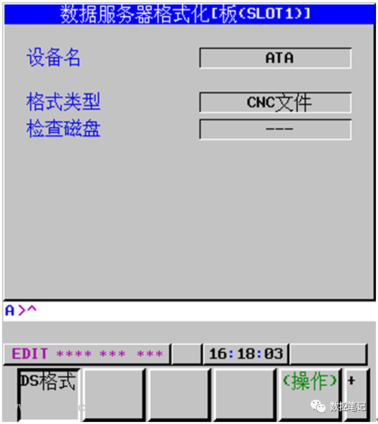](https://cdn.sk1z.com/wp-content/uploads/2022/07/10-1656676225.png)

按下“DS方式”键，出现如下画面：

[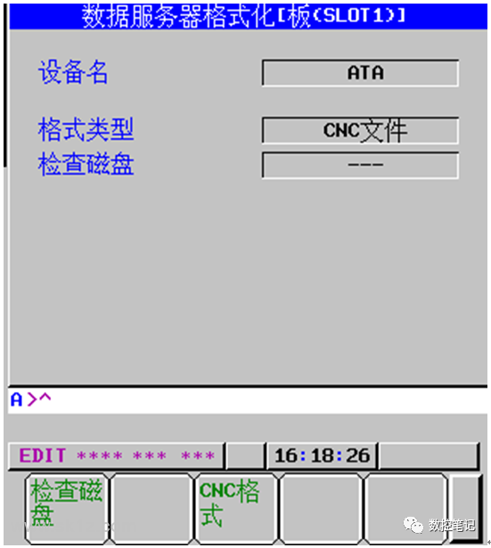](https://cdn.sk1z.com/wp-content/uploads/2022/07/1-1656676225.png)

按下“存储方式”，在“方式”一栏出现“存储模式”。采用“存储模式”，就是将远程FTP服务器上的零件程序传送到机床本地的CF卡上，然后在“DNC”方式下执行该程序，避免了工厂环境下因干扰严重而导致加工时的程序传送中断。

**二）机床本地CF卡的格式化，**

 这个步骤在第一次安装CF后是必须的，只需要进行一次，以后就不必进行这个工作。

按下“数据服务器”软键后，多次按下“+”键，直到出现下列画面 ：

[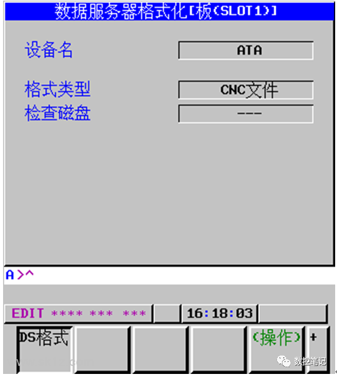](https://cdn.sk1z.com/wp-content/uploads/2022/07/8-1656676226.png)

按下“DS格式”后，按下“操作”键，出现如下画面

[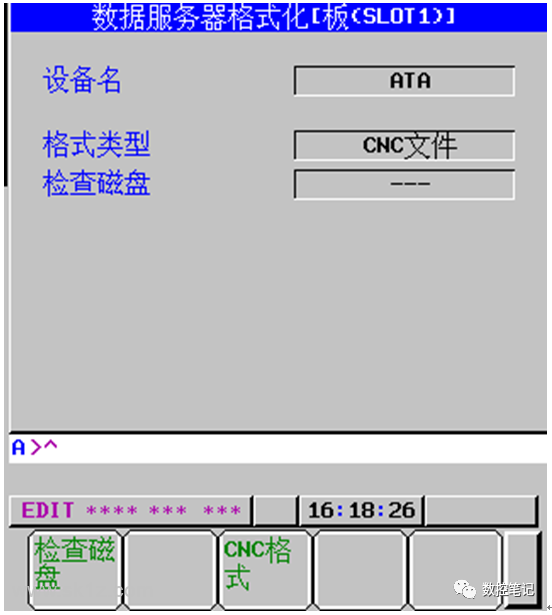](https://cdn.sk1z.com/wp-content/uploads/2022/07/5-1656676226.png)

按下“CNC格式”后，跳出如下画面，选择“确定”键，

[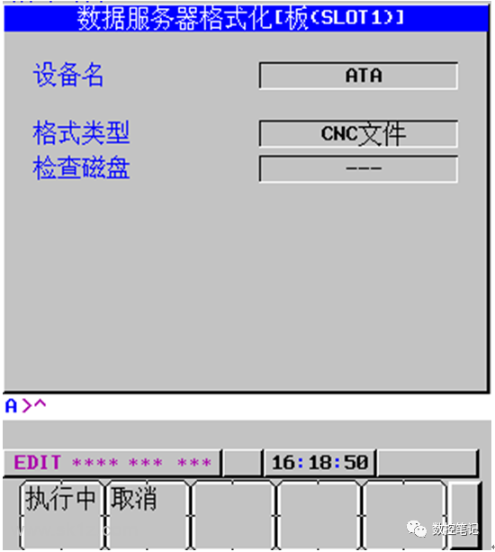](https://cdn.sk1z.com/wp-content/uploads/2022/07/8-1656676226-1.png)

格式化开始，直到结束。

如果格式化不能完成，可能存在兼容性问题，需要更换CF卡，最好选择正品Sandisk或FANUC原装CF卡，容量不超过2G。

 

**二、CNC FTP文件传输**

**一、进入“Edit”方式，按下“PROGRAM”软键，出现如下画面：**

按下“目录”键，然后按下“操作”软键，出现下列画面：

按下“设备选择”软键，出现下列画面：

其中：

“CNC MEM”代表 CNC内存，通常容量为512K到2M。

“DTSVR”代表机床本地的CF卡，通常容量是128M到2G，存放从远程FTP服务器获得的程序，机床DNC方式下执行这些程序。

“DTSVR 主机”代表远FTP服务器，按下这个键后，可以看到从远程FTP服务器存放的程序。

**二）按下“DTSVR 主机”软键，显示画面与下图类似：**

[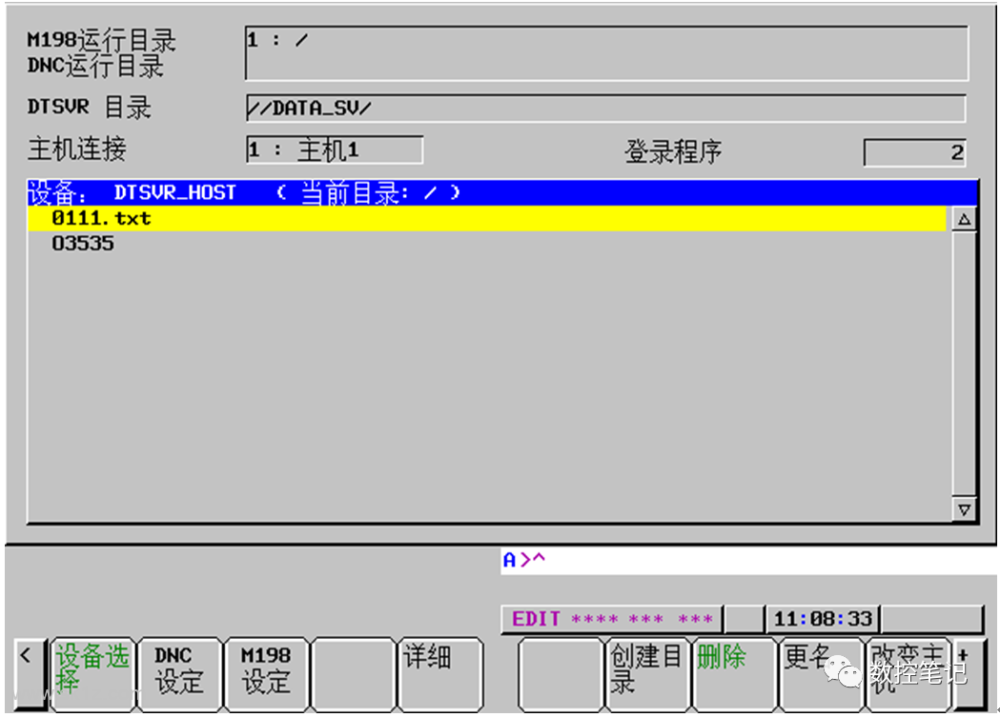](https://cdn.sk1z.com/wp-content/uploads/2022/07/10-1656676227.png)

移动光标到选择所需程序，多次按下“+”键，直到出现如下画面：

按下“GET”软键，远程FTP服务器的程序被传入到机床本地ＣＦ卡。

按下“STSVR”软键，显示机床本地CF卡上的已有的程序，画面与下图类似；

[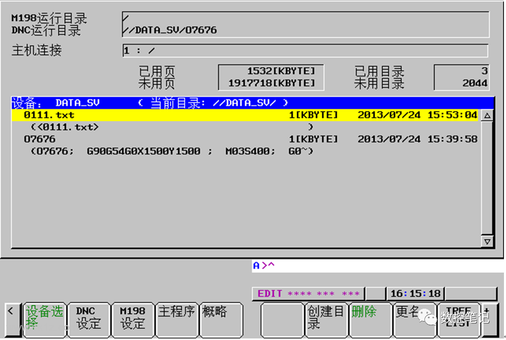](https://cdn.sk1z.com/wp-content/uploads/2022/07/0-1656676228.png)

移动光标到所需的文件，按下“DNC设定”软键，表明将以DNC方式运行这个程序，这时，上方的DNC运行目录的的显示内容将发生改变。

上图表明选中的程序是O7676，因为DNC运行目录显示“/DATA_SV.O7676”。

**三）进入 “DNC”方式，按下“Cycle Start”键，机床程序启动。**

**四）改变主机连接**，这一步不是必须的，有时用户在误操作时会改变机床默认的“主机1连接”，这是，就需要返回“主机1连接”， 让“主机1连接”生效。

[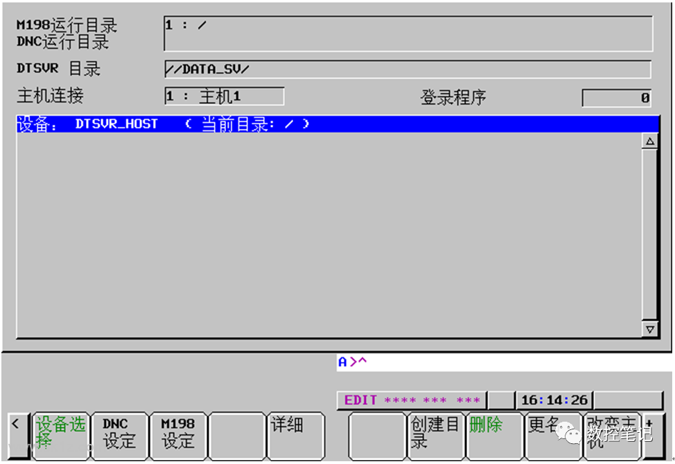](https://cdn.sk1z.com/wp-content/uploads/2022/07/3-1656676229.png)

按下“改变主机”软键，“主机连接”显示的内容将在“1：主机1”~“4：主机4”中循环显示，我们只设定了主机1的连接，因此一定要处于“1：主机1”。

 

**注意：**

对于Windows7 操作系统，一定要打开“文件和打印机共享功能”，否则不能在CNC上浏览PC上的存放零件程序的相应目录。具体步骤如下：

“控制面板”—》“网络和共享中心”—-》“查看网络状态和任务”—-》“更改高级共享配置”—-》“文件和打印机共享设置”。

对于Windows XP操作系统，“文件和打印机共享功能”是默认打开的。