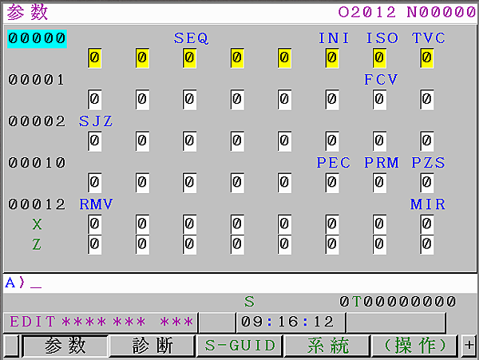
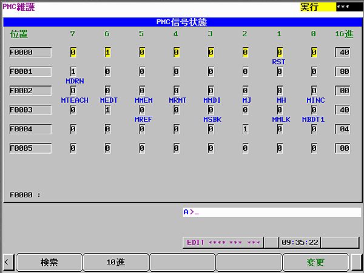
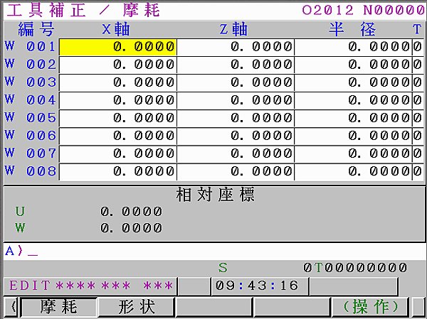
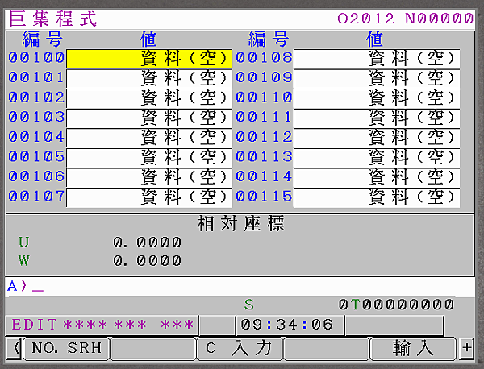

讀寫的部分目前我在這分幾類：
1.系統參數
2.PMC
3.補正
4.巨集(Macro

[原文](https://kilean.pixnet.net/blog/post/202048673-fanuc-focas1-2-in-c%23---%E5%8F%83%E6%95%B8%E8%AE%80%E5%AF%AB-%5B%E6%92%B0%E5%AF%AB%E4%B8%AD%5D)

**1.系統參數讀寫：**



有的參數有分軸向，有的沒有，

我不太會下-1去撈全部軸向，因為我會遇到錯誤，

所以用多少軸，我就下多少。

至於要用Byte, Word, DoubleWord 就要去看參數手冊，去查要使用的參數是屬於哪種資料長度。

```csharp
    public void WriteByteParam(short address,Byte data, short axis)
    {
      Focas1.IODBPSD param=new Focas1.IODBPSD();
      param.type=axis;
      param.datano=address;
      param.u.cdata=data;
      Focas1.cnc_wrparam(FFlibHndl, 5, param);
    }

    public void WriteWordParam(short address, short data, short axis)
    {
      Focas1.IODBPSD param=new Focas1.IODBPSD();
      param.type=axis;
      param.datano=address;
      param.u.idata=data;
      Focas1.cnc_wrparam(FFlibHndl, 6, param);
    }

    public void WriteDbWordParam(short address, int data, short axis)
    {
      Focas1.IODBPSD param=new Focas1.IODBPSD();
      param.type = axis;
      param.datano = address;
      param.u.ldata = data;
      Focas1.cnc_wrparam(FFlibHndl, 8, param);
    }

    public byte ReadByteParam(short address, short axis)
    {
      Focas1.IODBPSD param=new Focas1.IODBPSD();       
      int ret=Focas1.cnc_rdparam(FFlibHndl, address, axis, 5, param);
      if (ret == Focas1.EW_OK)
      {
        return param.u.cdata;
      }
      else 
      {
        return 0;
      }
    }

    public short ReadWordParam(short address, short axis)
    {
      Focas1.IODBPSD param=new Focas1.IODBPSD();       
      int ret = Focas1.cnc_rdparam(FFlibHndl, address, axis, 6, param);
      if(ret==Focas1.EW_OK)
      {
        return param.u.idata;
      }
      return 0;
    }

    public int ReadDbWordParam(short address, short axis)
    {
      Focas1.IODBPSD param=new Focas1.IODBPSD();
      int ret = Focas1.cnc_rdparam(FFlibHndl, address, axis, 8, param);
      if (ret == Focas1.EW_OK)
      {
        return param.u.ldata;
      }
      else
      {
        return 0;
      }
    }
```

**2.PMC讀寫：**



​    

```csharp
//這邊我先定義暫存器的編號
    public enum AddrType
    {
      G = 0,
      F = 1,
      Y = 2,
      X = 3,
      A = 4,
      R = 5,
      T = 6,
      K = 7,
      C = 8,
      D = 9,
      M = 10,
      N = 11,
      E = 12,
      Z = 13
    }

//這邊我先定義資料長度的編號
public enum LengthType
{
  BYTE = 0,
  WORD = 1,
  DWORD = 2
}
//Write PMC
public void WriteByteParam(AddrType addr_type, short address, byte value)
{
  Focas1.IODBPMC0 buf = new Focas1.IODBPMC0();
  buf.cdata = new byte[5];//必須自己建立，且大小要5。否則會發生錯誤
  buf.cdata[0] = (byte)value;
  buf.type_a = (short)addr_type;
  buf.type_d = (short)LengthType.BYTE;
  buf.datano_s = address;
  buf.datano_e = address;
  int ret = Focas1.pmc_wrpmcrng(FFlibHndl, 9, buf);
}
public void WriteWordParam(AddrType addr_type, short address, short value)
{
  Focas1.IODBPMC1 buf = new Focas1.IODBPMC1();
  buf.idata = new short[5];//必須自己建立，且大小要5。否則會發生錯誤
  buf.idata[0] = (short)value;
  buf.type_a = (short)addr_type;
  buf.type_d = (short)LengthType.WORD;
  buf.datano_s = address;
  buf.datano_e = (short)(address + 1);
  int ret = Focas1.pmc_wrpmcrng(FFlibHndl, 10, buf);
}
public void WriteDbWordParam(AddrType addr_type, short address, int value)
{
  Focas1.IODBPMC2 buf = new Focas1.IODBPMC2();
  buf.ldata = new int[5];//必須自己建立，且大小要5。否則會發生錯誤
  buf.ldata[0] = (int)value;
  buf.type_a = (short)addr_type;
  buf.type_d = (short)LengthType.DWORD;
  buf.datano_s = address;
  buf.datano_e = (short)(address + 3);
  int ret = Focas1.pmc_wrpmcrng(FFlibHndl, 12, buf);
}
//Ex: Write PMC E200 = 2
//WriteByteParam(AddrType.E, 200, 2);

  //Read PMC
public byte ReadByteParam(AddrType addr_type, ushort address)
{
  Focas1.IODBPMC0 buf = new Focas1.IODBPMC0();
  short ret = Focas1.pmc_rdpmcrng(FFlibHndl, (short)addr_type, (short)LengthType.BYTE, address, address, 9, buf);
  if (ret == Focas1.EW_OK) return (byte)buf.cdata[0];
  return 0;
}

public short ReadWordParam(AddrType addr_type, ushort address)
{
  Focas1.IODBPMC1 buf = new Focas1.IODBPMC1();
  short ret = Focas1.pmc_rdpmcrng(FFlibHndl, (short)addr_type, (short)LengthType.WORD, address, (ushort)(address + 1), 10, buf);
  if (ret == Focas1.EW_OK) return (short)buf.idata[0];
  return 0;
}

public int ReadDbWordParam(AddrType addr_type, ushort address)
{
  Focas1.IODBPMC2 buf = new Focas1.IODBPMC2();
  short ret = Focas1.pmc_rdpmcrng(FFlibHndl, (short)addr_type, (short)LengthType.DWORD, address, (ushort)(address + 3), 12, buf);
  if (ret == Focas1.EW_OK) return (int)buf.ldata[0];
  return 0;
}
//Ex: Read PMC E200
//byte val = ReadByteParam(AddrType.E, 200);
```

 

**3.補正**



  

```csharp
  //這邊我定義刀具補正的結構

public class OffsetData
{
  //Wear       
  public int WearX;
  public int WearZ;
  public int WearRadius;
  //Geometry
  public int GeometryX;
  public int GeometryZ;
  public int GeometryRadius;       
}

public OffsetData ReadToolOffset(short no)
{
  Focas1.ODBTOFS ofs = new Focas1.ODBTOFS();
  OffsetData data = new OffsetData();

  short ret;
  //Wear
  ret = Focas1.cnc_rdtofs(FFlibHndl, no, 0, 8, ofs);
  if (ret == Focas1.EW_OK) data.WearX = ofs.data;       
  ret = Focas1.cnc_rdtofs(FFlibHndl, no, 2, 8, ofs);
  if (ret == Focas1.EW_OK) data.WearZ = ofs.data;
  ret = Focas1.cnc_rdtofs(FFlibHndl, no, 4, 8, ofs);
  if (ret == Focas1.EW_OK) data.WearRadius = ofs.data;
  
  //Geometry
  ret = Focas1.cnc_rdtofs(FFlibHndl, no, 1, 8, ofs);
  if (ret == Focas1.EW_OK) data.GeometryX = ofs.data;
  ret = Focas1.cnc_rdtofs(FFlibHndl, no, 3, 8, ofs);
  if (ret == Focas1.EW_OK) data.GeometryZ = ofs.data;
  ret = Focas1.cnc_rdtofs(FFlibHndl, no, 5, 8, ofs);
  if (ret == Focas1.EW_OK) data.GeometryRadius = ofs.data;
  
  return data;
}

public void WriteToolOffset(short no, OffsetData data)
{
  short ret;
  //Wear
  ret = Focas1.cnc_wrtofs(FFlibHndl, no, 0, 8, data.WearX);
  ret = Focas1.cnc_wrtofs(FFlibHndl, no, 2, 8, data.WearZ);
  ret = Focas1.cnc_wrtofs(FFlibHndl, no, 4, 8, data.WearRadius);

  //Geometry
  ret = Focas1.cnc_wrtofs(FFlibHndl, no, 1, 8, data.GeometryX);
  ret = Focas1.cnc_wrtofs(FFlibHndl, no, 3, 8, data.GeometryZ);
  ret = Focas1.cnc_wrtofs(FFlibHndl, no, 5, 8, data.GeometryRadius);      
}
```


4.巨集(Macro)



這邊只列我有在使用的部分，這些就足夠提供公司的應用

有些函式其實是一樣的功能，但是卻不好用，

​    

```csharp
public short WriteMacro(int no, double val)
    { 
      //範圍:
      //#100~#999
      //#98000~#98499  
      int num = 1;
      short ret=Focas1.cnc_wrmacror2(FFlibHndl, no, ref num, val);       
      return ret;
    }

public short ReadMacro(int no, out double val)
{
  //範圍:
  //#1~#33
  //#100~#999
  //#1000~
  //#98000~#98499       
  int num=1;
  double [] result = new double [1];
  short ret=Focas1.cnc_rdmacror2(FFlibHndl, no,ref num, result);
  if(ret==Focas1.EW_OK)
  {
    val = result[0];
  }
  else
  {
    val = 0;
  }
  return ret;
}

public short WritePMacro(uint no, double val)
{
  //範圍
  //#10000~#89999 實際範圍請參考cnc_rdpmacroinfo, cnc_rdpmacroinfo2
  uint num=1;            
  short ret=Focas1.cnc_wrpmacror2(FFlibHndl, no, ref num, 0, val);
  return ret;
}

public short ReadPMacro(uint no, out double val)
{
  //範圍
  //#10000~#89999 實際範圍請參考cnc_rdpmacroinfo, cnc_rdpmacroinfo2
  uint num = 1;           
  double[] result = new double[1];
  short ret = Focas1.cnc_rdpmacror2(FFlibHndl, no, ref num, 0, result);
  if (ret == Focas1.EW_OK)
  {
    val = result[0];
  }
  else
  {
    val = 0;
  }
  return ret;
}
```

