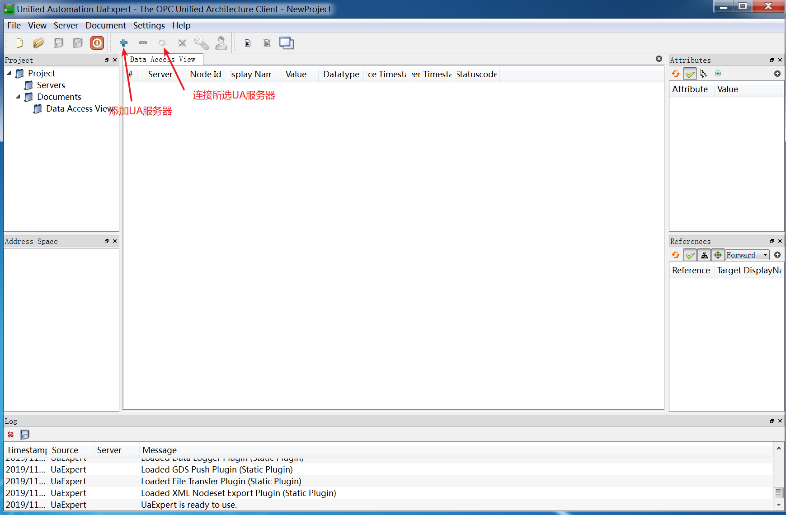
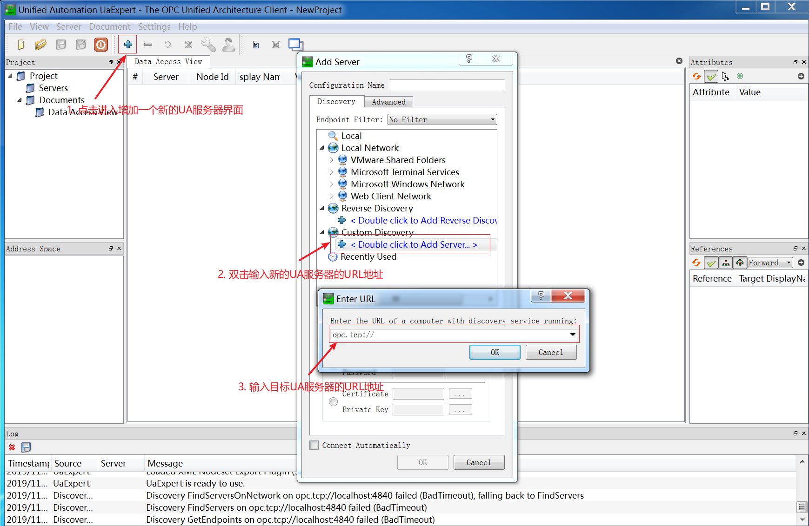
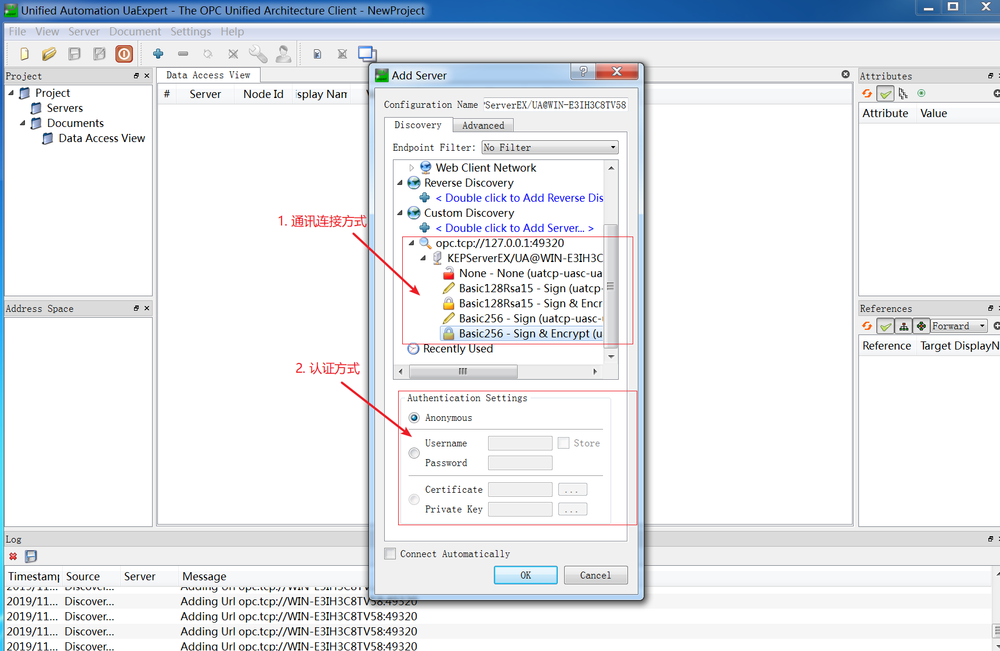
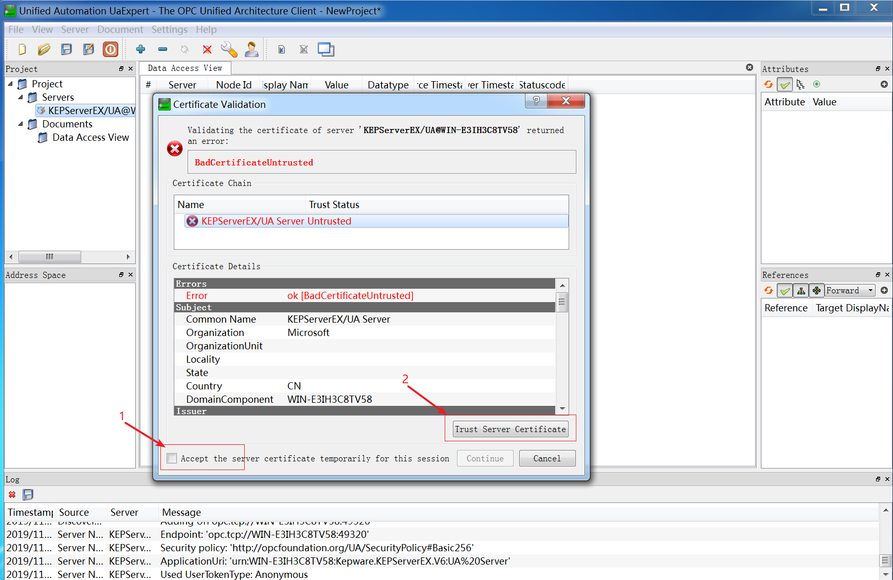
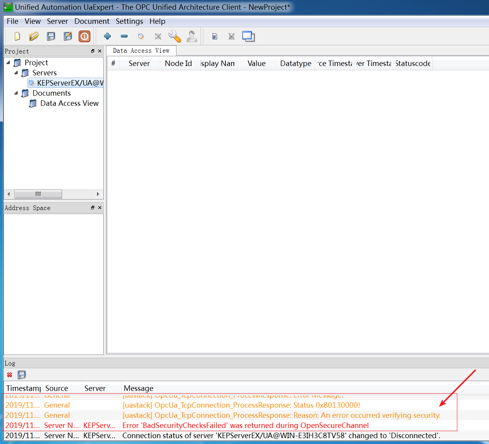
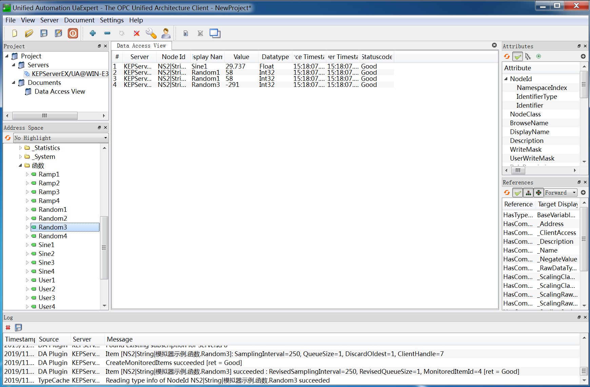

# uaexpert 简易说明

**本目录下还有个PDF文档，也可以快速上手**

UaExpert 是unified-automation提供的一个功能齐全的OPC UA客户端，支持OPC UA功能（如DataAccess，警报和条件，历史访问以及UA方法调用）的通用测试客户端。

------

## 安装

UaExpert在Windows系统上安装很简单，运行安装包，按照提示一步一步安装即可。安装完成，在桌面会创建名为UaExpert的快捷方式 UaExpert[下载链接](https://thingscloud.oss-cn-beijing.aliyuncs.com/download/uaexpert-bin-win32-x86-vs2008sp1-v1.5.0-319.exe)

## 使用

\1. 首次运行UaExpert，会提示创建一个自签名的电子证书，用于UA的加密通讯，点击OK即可，在创建的界面中按照提示输入对应的信息（组织名称，单位名称，地址，所属州，国家代码），点击OK即可。

\2. 第一步完成后将进入主界面，主要关注图中标注图标即可。 

\3. 在导航栏在点击+图标，增加一个新的UA服务器。过程如下图，OPUA地址一般为opc.tcp://ipaddr:port 

\4. 添加OPC UA的URL并确定后，如能连接到UA服务器，点击UA服务器前面的展开图标，就可看见UA服务器支持的各种连接方式。通讯方式任选一种即可，如UA服务器的认证方式不支持匿名，那么需要输入UA服务器提供的用户/密码连接信息。 

\5. 添加完成后，UaExpert并未自动连接UA服务器，需要选中UA服务器并点击导航栏的连接图标，才会连接UA服务器。如UA服务器证书属于自签名证书，将弹出如下提示，点击信任服务器证书按钮，点击continue按钮即可。 

\6. 如UA服务器一段并不是自动接受UA客户端证书的方式，那么需要到UA服务器的配置中将当前UA客户端证书设置为允许或信任。当UA服务器不接受当然UA客户端证书时，UaExpert提示信息如下： 

7.以上过程及相关设置正确后，UaExpert就可连接到UA服务器了，在左侧UA的节点树中选择希望监视的测点，拖拽到右侧的监视框中即可。强调一下：监视框中的Node ID一列会显示UA服务器测点的NS节点编号|支持的访问方式|测点访问的全路径，这对创建FreeIOE的OPCUA客户端的设备模版很有帮助。 