# 西门子PLC1500 OPC ua 通信测试（ua Expert）

[西门子PLC1500 OPC ua 通信测试（ua Expert）](https://www.cnblogs.com/Lion-Ming/p/12317133.html)

一、资料：

1、西门子提供的OPC UA Client资料：

全球资源库搜索：109737901

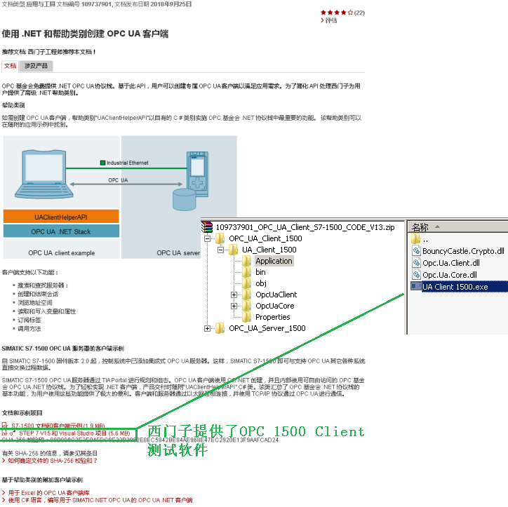

 

 

 此例不使用该测试软件

 

 

2、第三方测试软件 Ua Expert  下载地址：

https://www.unified-automation.com/downloads/opc-ua-clients.html

3、视频资料地址：

http://wap.siemens.com.cn/service/elearning/videos/1904.html

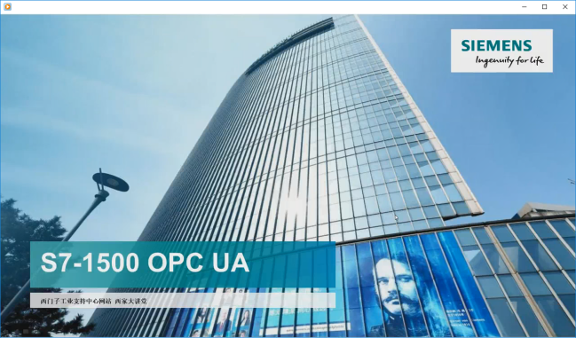

 

 

 

二、测试

1、设备组态、编译、下载完成。

2、导出客户端工业证书：

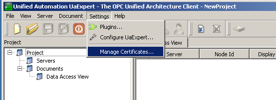

 注意：需要检查创建的根证书

 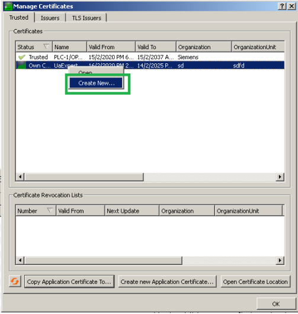

 

 

注意需要填写调试电脑的IP地址

 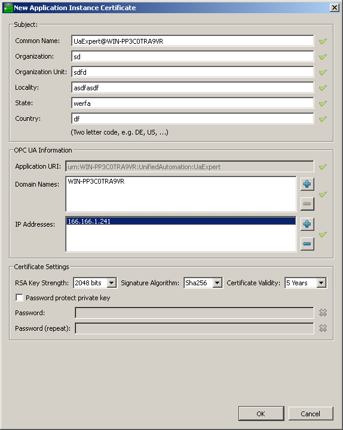

导出证书

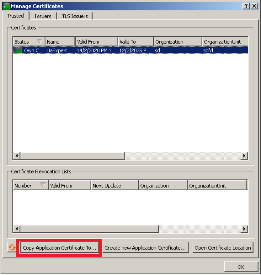

 

 

 

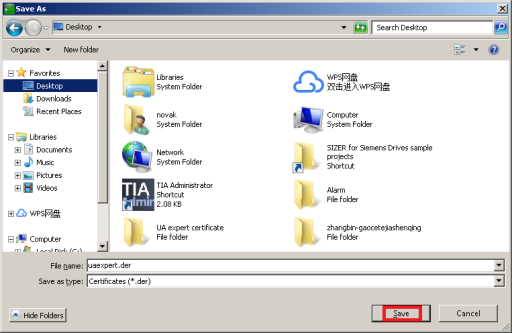

 

 3、PLC配置

 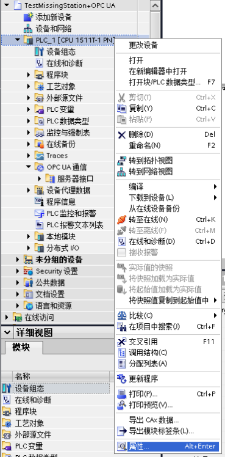

 

 激活OPC UA服务器

 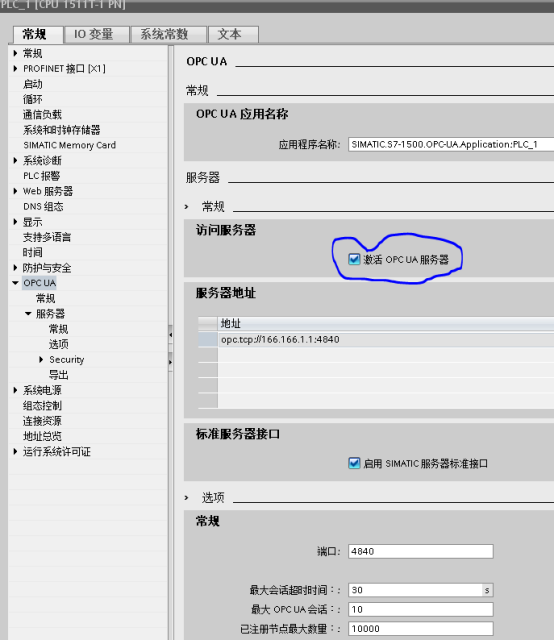

 

 确认所需授权

 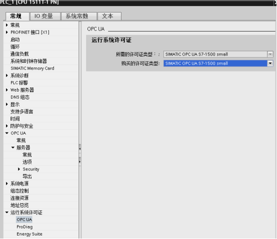

 

 证书管理器设置

 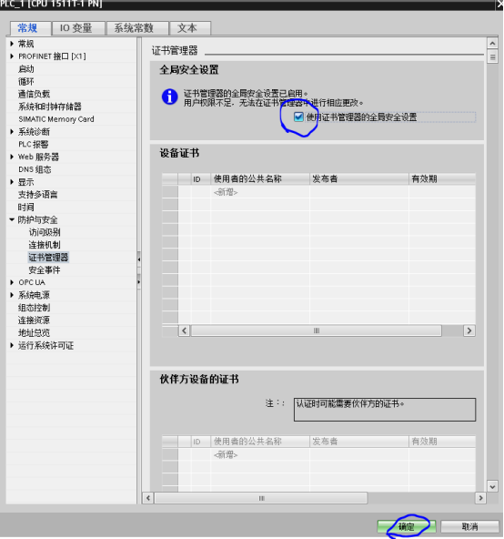

 

 安全设置

注意：此处设置的用户名和密码需要牢记，以后打开该项目都需要输入此用户名和密码。

此例设置用户名：user  密码：OPCua123

 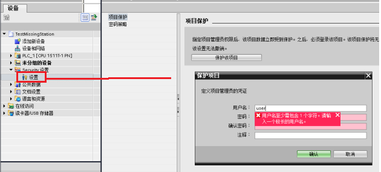

 

 证书管理器导入证书

 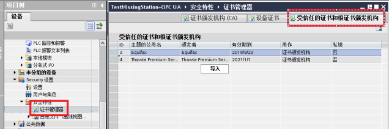

 

 PLC 属性-给服务器创建证书

注意：证书是有有效期的，PLC 服务器和客户端需要时间同步一下。

 **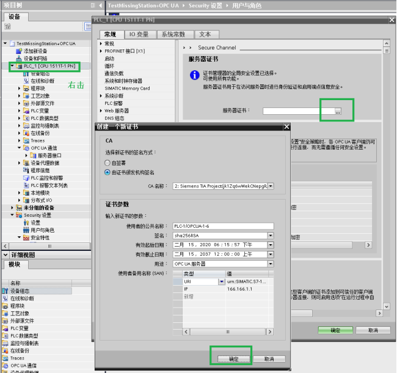**

选择受信任的客户端证书。

 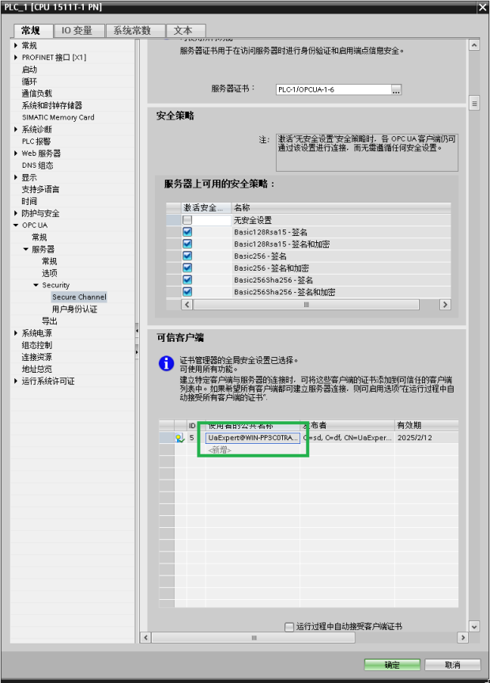

 

 根据应用需求在PLC属性页启动用户身份认证：

此例：user1  密码1234567890

Users  密码0987654321

 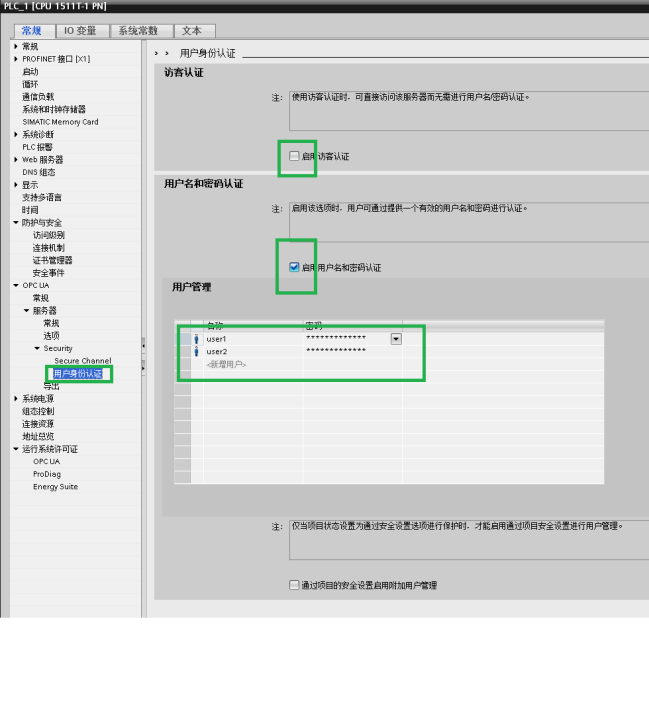

**编译下载。**

PLC属性-复制客户端地址：（eg： opc.tcp://166.166.1.1:4840）

 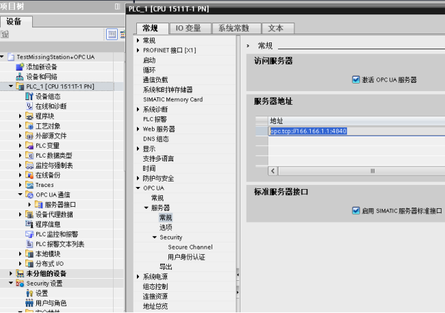

 

 

 

 

客户端连接：

添加服务器:

 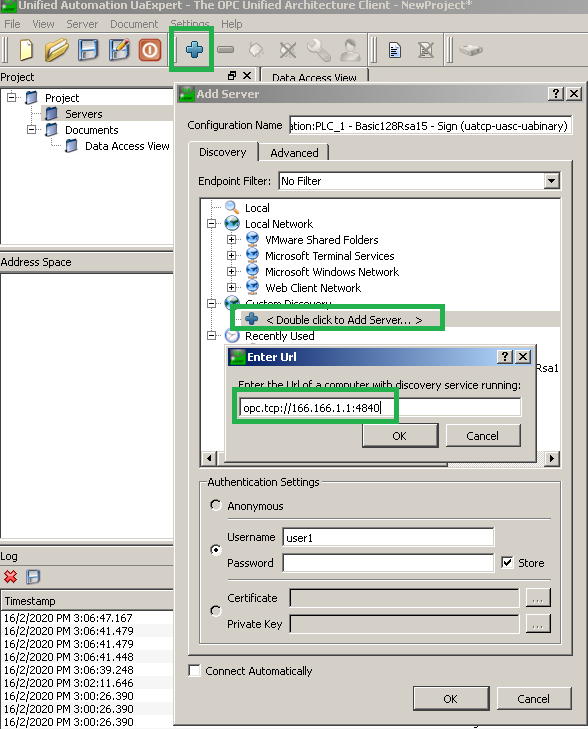

 

 

 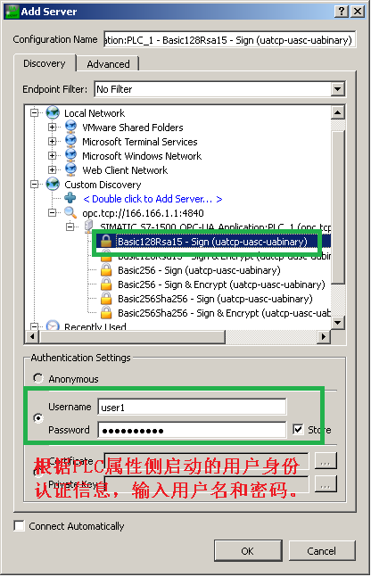

 

 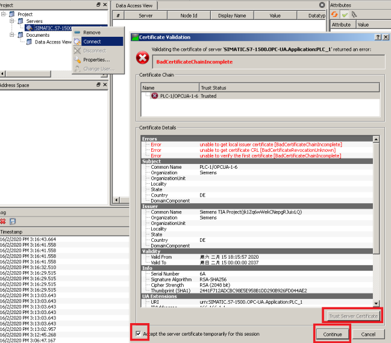

 

 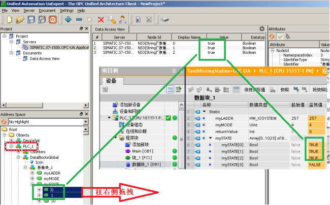

 

 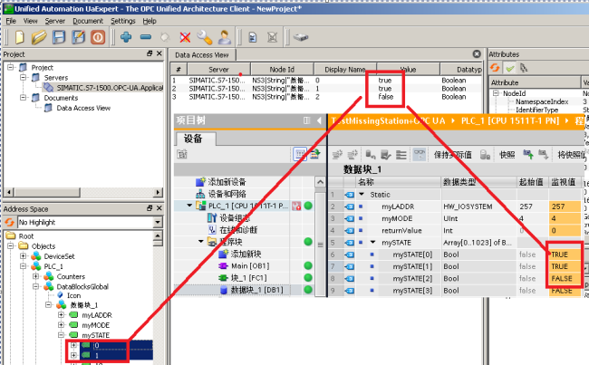