# **西门子组态软件WINCC7.5安装教程**

**安装说明：看不清的可以放大看，任何一步做错了，有可能需要直接重做系统。所以请认真对照教程安装。**

 

**1**、在安装软件之前请关闭计算机中所有正在运行的应用程序。**

**2**、安装此软件前请先关闭防火墙、****360****、金山卫士、瑞星杀毒、防木马软件，优化软件等软件。（或者是别的电脑防护软件一定要关闭）**

**3**、安装软件的时候不要更改安装路径，默认磁盘路径安装，如果做了更改，可能会导致软件无法运行！**

**4**、操作系统要求原版操作系统，不能是****GHOST****版本，也不能是优化后的版本，如果不是原版操作系统，你可以试着安装，有可能会在安装中报故障，如果你的系统以前安装过以前版本的****WINCC****，请你重装系统后再安装。**

**5***、在****Windows10****下安装软件，为了防止权限不够安装出错，需要在安装程序上选择以管理员身份运行此程序。**

**6**、需要使用西门子****step7****软件的用户请先安装****step7****。不需要就算。**

**此软件有两种安装方法，一种是光盘发送的，这种插入光盘后即可直接安装。我们下面所说的方法主要是针对软件下载后解压安装的。使用****WinRAR****等解压软件进行解压，一般电脑自带，没有请自行下载。**

**7、****本教程是以****Microsoft Windows 10****操作系统为例。**

 

 

**开始安装：**

**1****系统设置**

 

 

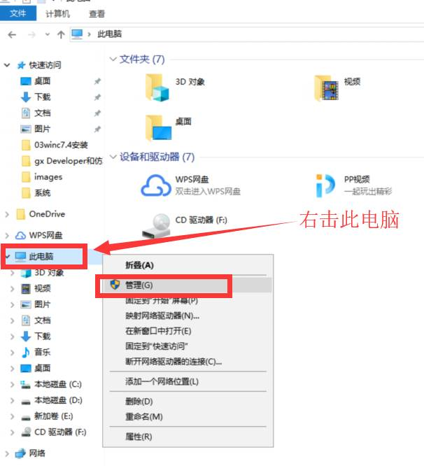

 

 

 

 

 

 

 

 

 

 

 

 

 

 

 

 

 

 

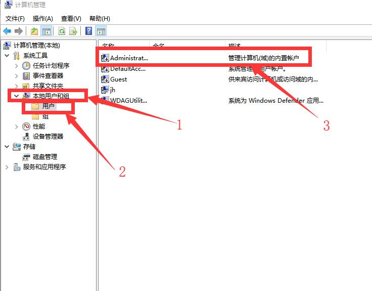

 

 

 

 

 

 

 

 

 

 

 

 

 

 

 

 

 

**第一行****Administrator****是最高管理员权限，先看看是否被禁用了。如果被禁用则需要取消禁用。**

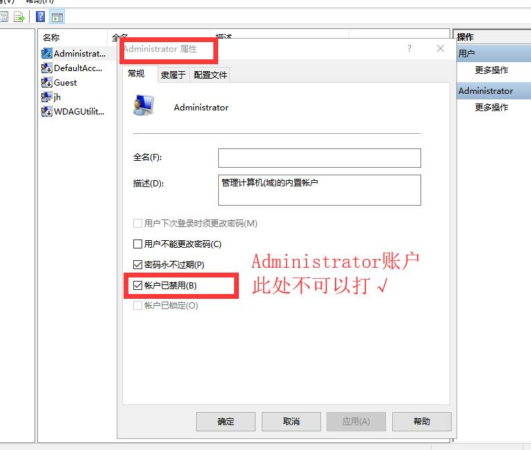

 

 

 

 

 

 

 

 

 

 

 

 

 

 

**然后把自己创建的管理员账户禁用，只有在****Administrator****管理员权限下授权才能完整，不会被限制。我自己的是第四行****jh****，看看你们的是什么用户，如果你直接就是****Administrator****管理员，无需操作此步，第二行****guest****用户不需要操作，其余账户都禁用。然后重启电脑如此下图。**

 

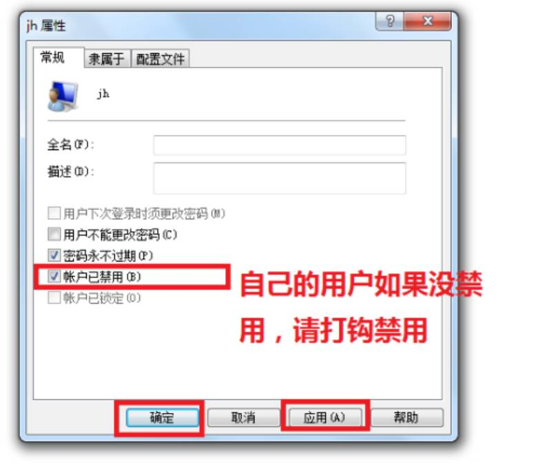

 

 

 

**2****重启电脑后取消系统保护**

**打开控制面板****---****系统和安全****---****系统**

**（不会打开控制面板的可以百度一下，很简单的）**

 

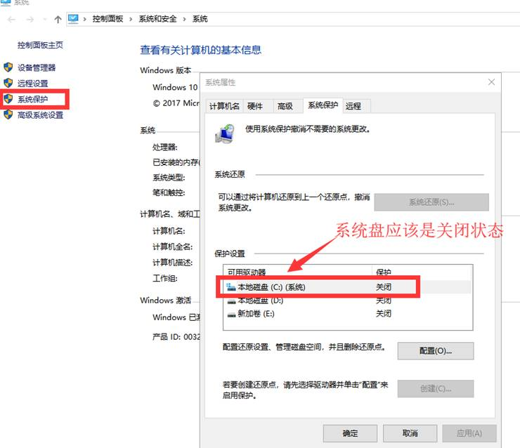

 

 

 

 

 

 

 

 

 

 

 

 

**3****安装消息列队：打开控制面板（不会打开控制面板的可以百度一下，很简单的）**

**右上角选择大图标，然后打开程序和功能**

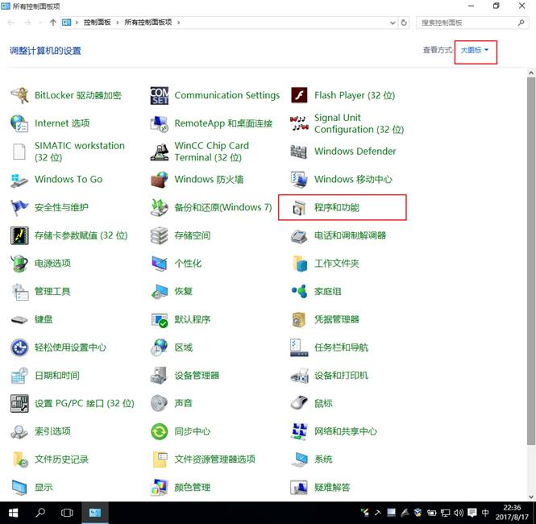

 

 

 

 

 

**然后在选择启用或关闭****WINDOWS****功能**

 

 

 

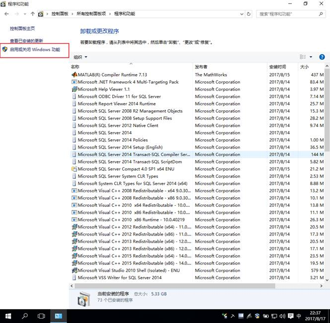

 

 

 

 

 

 

 

 

 

 

**然后勾选****.NET 3.5** **和****MSMQ****服务器确定就完成了，接下来就可以安装**

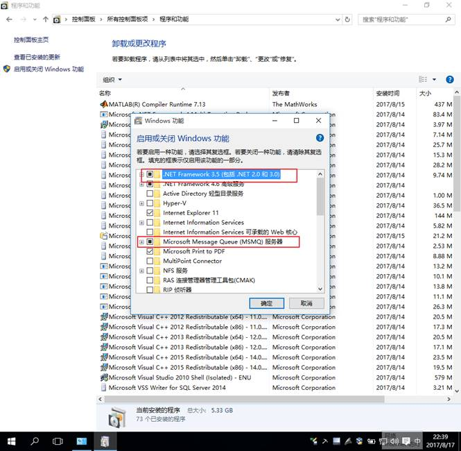

 

**之后重启电脑，电脑开机后别忘了退出杀毒软件，****360****和电脑管家等，前面已经说明。**

 

 

 

 

 

 

 

 

**4 WINCC****安装：**

**一．****WinCC_V7.5.iso****。这个文件格式为虚拟光驱格式，可以用虚拟光驱进行安装，如果你不会用虚拟光驱，也可以用****WINARA****解压后安装。没有****WinRAR****的自己百度一个下载安装。下面是解压后的安装说明。**

**二．****特别提醒，右击压缩包，选择：解压到****WinCC_V7.5**

**之后把****WinCC_V7.5****（记住是文件夹）****剪切到****c****盘根目录（安装完删除即可，这样就不占用****c****盘内存了），不放****c****盘根目录导致安装失败的，可能需要重做系统了**

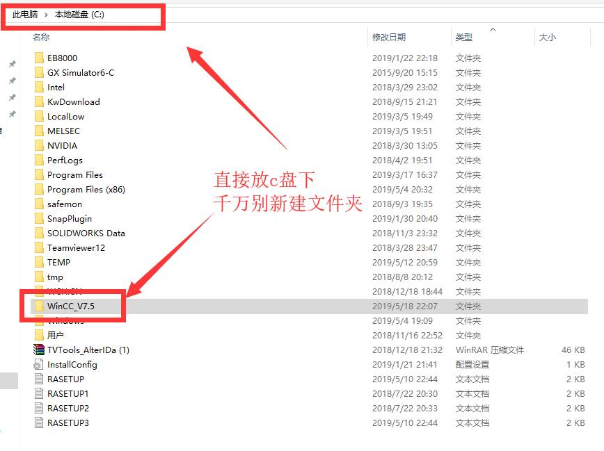

 

 

**鼠标右击****setup****，以管理员身份运行，**

 

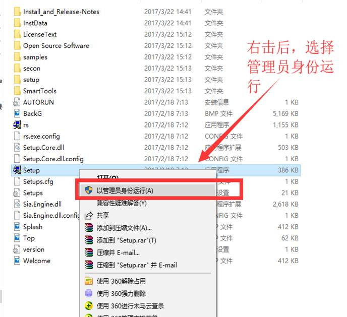

 

**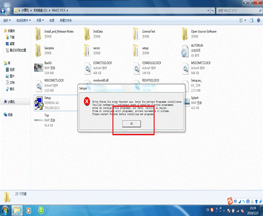**

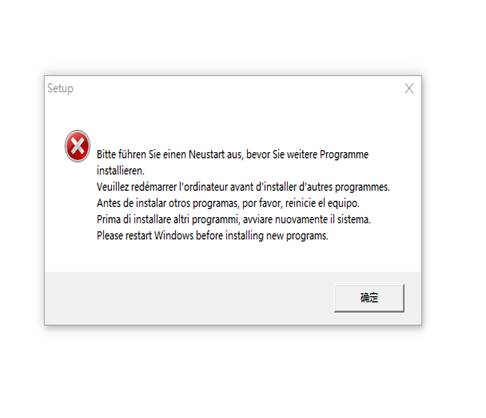

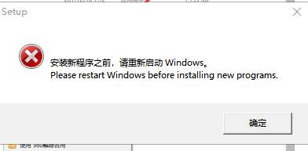

 

**如果安装过程出现类似如上图的提示，那么请删注册表**

**
** **w10****系统，桌面上左下角那个框中，输入，****regedit,****回车进入注册表** **“****HKEY_LOCAL_MACHINE\System\CurrentControlSet\Control\SessionManager\****”中删除注册表值**

**“****PendingFileRenameOperations****”不要重新启动，继续安装。**

**千万别删错哦。**

**友情提示****:****找到这个** **SessionManager****，双击它，右侧有** **“****PendingFileRenameOperations****”，****千万别删错了****，不然重做系统，重新来。如下图：**

 

 

 

**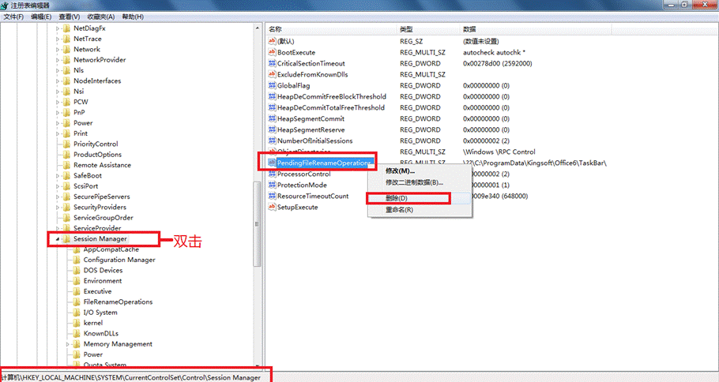**

 

**WINCC****安装**

 

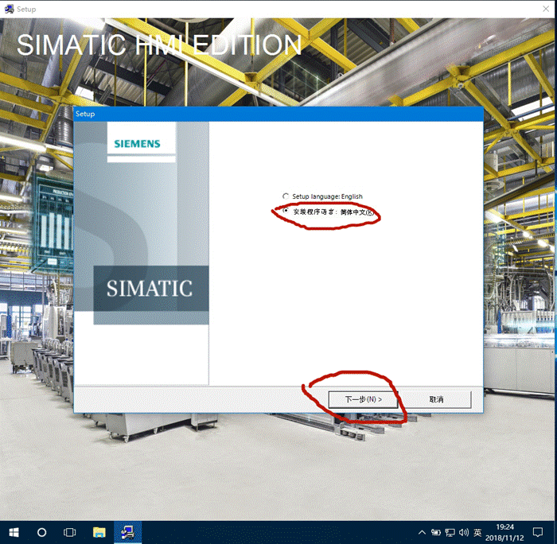

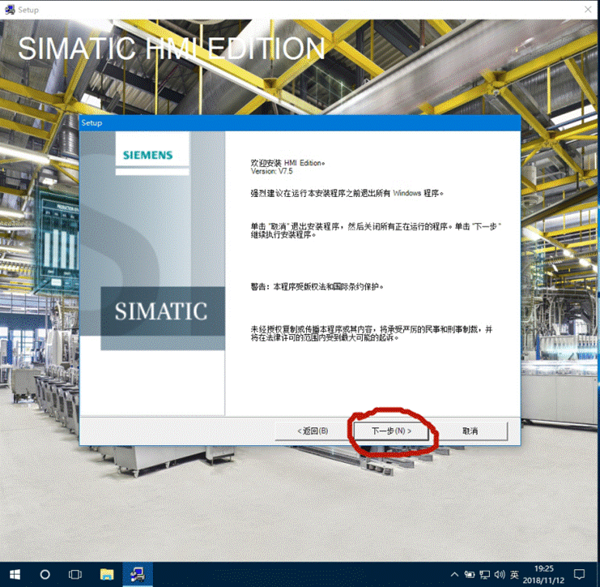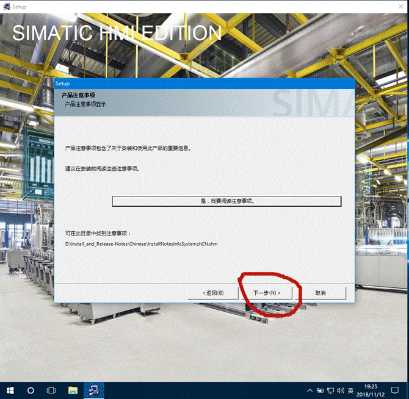

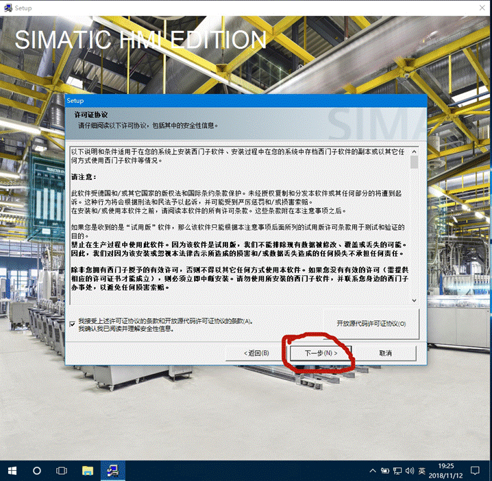

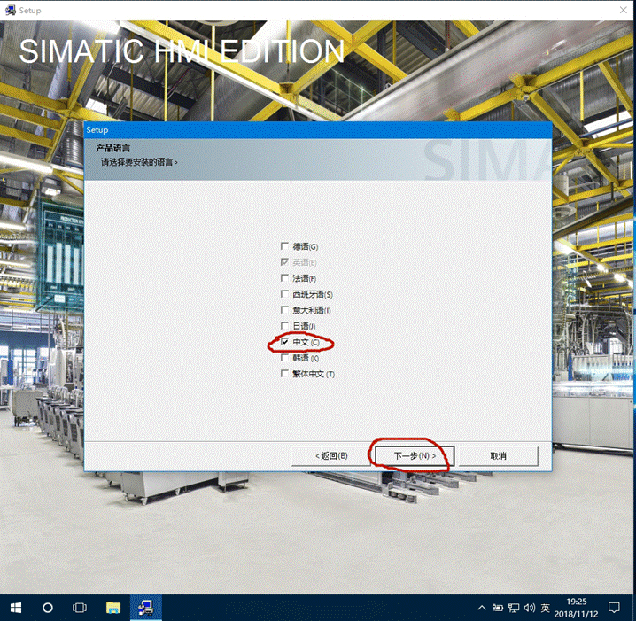

 

 

 

 

 

 

**上面默认路径，显示什么路径就是什么，不要改，否则请重做系统再来**

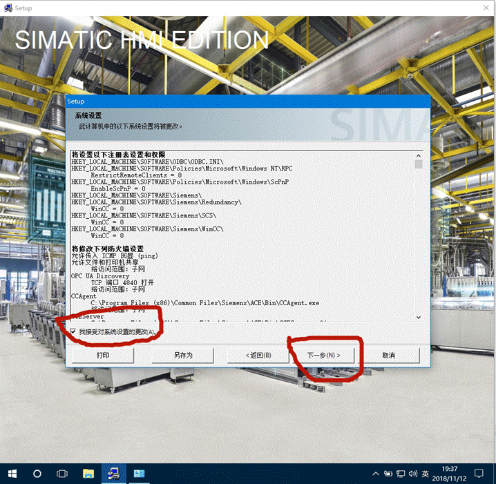

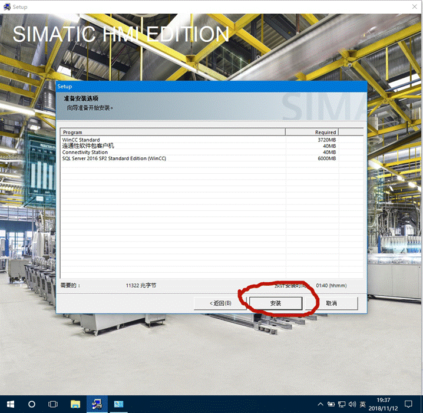

 

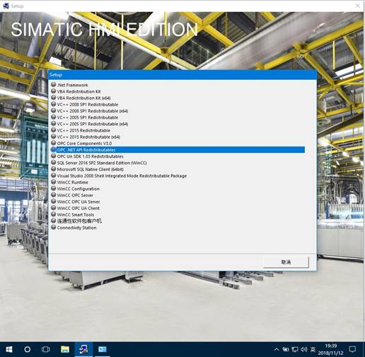

 

 

 

 

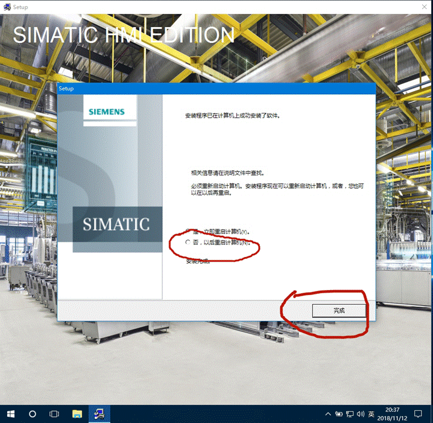

 

 

 

 

 

 

 

 

 

 

 

**先不要着急打开软件，先对软件进行授权，再做免狗补丁（在另外两文件中）截图如下，再打开文件夹根据提示做。**

 

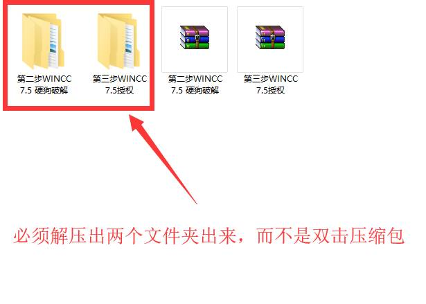

 