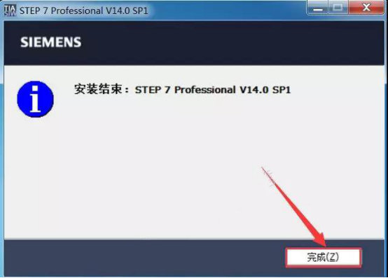
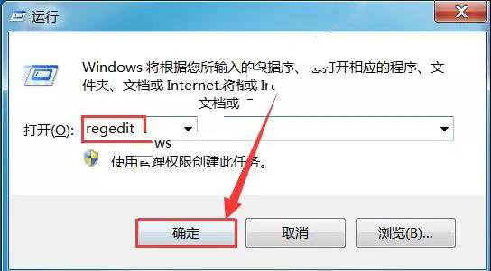
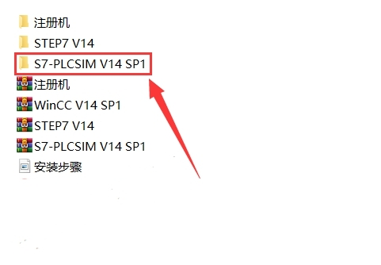
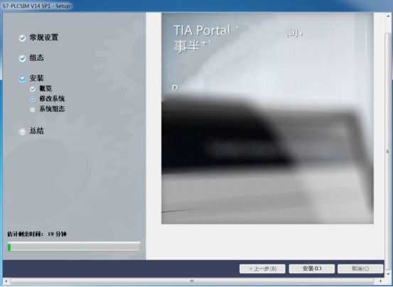
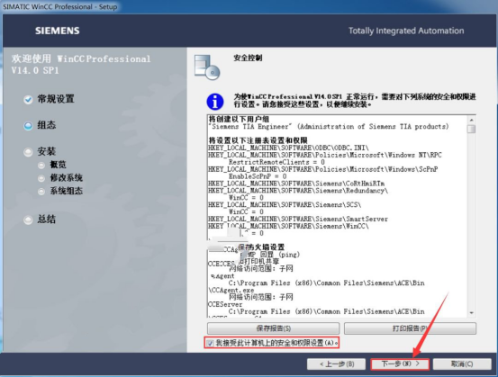

# 博途 V14安装教程

安装前先关闭杀毒软件和360卫士，注意安装路径不能有中文，安装包路径也不要有中文。

 

| 温馨提醒：安装此软件电脑配置至少应满足以下要求               |                                                              |
| ------------------------------------------------------------ | ------------------------------------------------------------ |
| 处理器                                                       | CoreTM i5-3320M 3.3 GHz 或相当                               |
| [内存](https://so.csdn.net/so/search?q=内存&spm=1001.2101.3001.7020) | 至少8G                                                       |
| 硬盘                                                         | 300 GB [SSD](https://so.csdn.net/so/search?q=SSD&spm=1001.2101.3001.7020) |
| 显示器                                                       | 15.6' 宽屏显示 (1920 x 1080)                                 |

 

1.双击打开【Siemens v14 sp1】文件夹。

2.鼠标右击【STEP7 V14】压缩包选择【解压到STEP7 V14】。

3.双击打开【STEP7 V14】压缩包解压后的【STEP7 V14】文件夹。

4.鼠标右击【SIMATIC_STEP_7_Professional_V14_SP1_1】选择【以管理员身份运行】。

5.点击【下一步】。

6.点击【下一步】。

7.点击【浏览】更改解压路径，建议解压到除C盘之外的其它磁盘内，可在E盘或其它磁盘内新建一个【SIMATIC STEP 7 Professional V14.0 SP1】文件夹，然后勾选【覆盖文件且不提示】，然后点击【下一步】。

8.正在解压（大约需要5分钟）。

9.点击【否】。

10.点击【确定】。

11.点击【完成】。

12.使用快捷键【Win+R】打开运行界面，然后输入【regedit】，然后点击【确定】。

13.双击打开注册表路径至：HKEY_LOCAL_MACHINE\SYSTEM\CurrentControlSet\Control\Session Manager，然后鼠标右击【PendingFileRenameOperations】选择【删除】。

14.点击【是】。

15.双击打开【Siemens v14 sp1】文件夹里的【STEP7 V14】压缩包解压后的【STEP7 V14】文件夹。

16.鼠标右击【SIMATIC_STEP_7_Professional_V14_SP1】选择【以管理员身份运行】。

17.点击【下一步】。

18.点击【下一步】。

19.点击【浏览】选择解压路径，建议解压到第7步中更改后的解压路径（这里解压到：E:\SIMATIC STEP 7 Professional V14.0 SP1），然后勾选【覆盖文件且不提示】，然后点击【下一步】。

20.正在解压。

21.点击【下一步】。

22.点击【下一步】。

23.勾选【WinCC flexible 2008 SP2/SP3 中的项目移植、SQL installation】，然后点击【浏览】更改安装路径，建议安装在除C盘之外的其它磁盘内，可在E盘或其它磁盘内新建一个【Siemens】文件夹，然后在新建的【Siemens】文件夹中新建一个【Automation】文件夹，然后点击【下一步】。

24.勾选【本人接受所列出的许可协议中的所有条款】和【本人特此确认，已阅读并理解了有关产品安全操作的安全信息】，然后点击【下一步】。

25.勾选【我接受此计算机上的安全和权限设置】然后点击【下一步】。

26.点击【安装】。

27.正在安装中（大约需要30分钟）。

28.弹出此界面（请勿关闭）。

29.双击打开【Siemens v14 sp1】文件夹，鼠标右击【注册机】压缩包选择【解压到注册机】。

30.双击打开【注册机】压缩包解压后的【注册机】文件夹。

31.鼠标右击【Sim_EKB_Install_2017_04_01】选择【以管理员身份运行】。

32.双击【TIA Portal】,然后点击选中【TIA Portalv14(2016)】。

33.勾选【短名称】，然后点击【安装长密钥】。

34.当【长名称】一列颜色变蓝后说明注册成功，然后点击右上角的【❌】关闭程序。

35.打开第28步中的界面，然后点击【重试许可证传送】。

36.正在验证（大约需要3分钟）。

37.点击【重新启动】。

38.取消勾选【每日检查更新】然后点击【确定】。

39.在桌面上双击【TIA Portal V14】软件图标启动软件。

40.安装完成，【TIA Portal V14】软件运行界面如下。

41.双击打开【Siemens v14 sp1】文件夹，鼠标右击【S7-PLCSIM V14 SP1】压缩包选择【解压到S7-PLCSIM V14 SP1】。

42.双击打开【S7-PLCSIM V14 SP1】压缩包解压后的【S7-PLCSIM V14 SP1】文件夹。

43.鼠标右击【SIMATIC_S7PLCSIM_V14_SP1】选择【以管理员身份运行】。

44.点击【下一步】。

45.点击【下一步】。

46.点击【浏览】更改解压路径，建议解压到除C盘之外的其它磁盘内，可在E盘或其它磁盘内新建一个【SIMATIC_S7-PLCSIM_V14_00_01_00】文件夹，然后点击【下一步】。

47.正在解压。

48.点击【否】。

49.点击【确定】。

50.点击【完成】。

51.使用快捷键【Win+R】打开运行界面，然后输入【regedit】，然后点击【确定】。

52.双击打开注册表路径至：HKEY_LOCAL_MACHINE\SYSTEM\CurrentControlSet\Control\Session Manager，然后鼠标右击【PendingFileRenameOperations】选择【删除】。

53.点击【是】。

54.双击打开【Siemens v14 sp1】文件夹中的【S7-PLCSIM V14 SP1】压缩包解压后的【S7-PLCSIM V14 SP1】文件夹。

55.鼠标右击【SIMATIC_S7PLCSIM_V14_SP1】选择【以管理员身份运行】。

56.点击【下一步】。

57.点击【下一步】。

58.点击【浏览】更改解压路径，建议解压到第46步中更改后的【SIMATIC_S7-PLCSIM_V14_00_01_00】文件夹，然后勾选【覆盖文件且不提示】，然后点击【下一步】。

59.正在解压。

60.点击【下一步】。

61.点击【下一步】。

62.点击【浏览】更改安装路径，建议安装在第23步中新建的【Siemens】文件夹的里面的【Automation】文件夹，然后点击【下一步】。

63.勾选【本人接受所列出的许可协议中的所有条款】和【本人特此确认，已阅读并理解了有关产品安全操作的安全信息】，然后点击【下一步】。

64.勾选【我接受计算机上的安全和权限设置】然后点击【下一步】。

65.点击【安装】。

66.正在安装中(大约需要15分钟)。

67.点击【重新启动】。

68.双击打开【Siemens v14 sp1】文件夹中的【注册机】压缩包解压后的【注册机】文件夹。

69.鼠标右击【Sim_EKB_Install_2017_04_01】选择【以管理员身份运行】。

70.点击【需要的密钥】，然后勾选【短名称】，然后点击【安装长密钥】。

71.点击【All】。

72.当【长名称】一列变为蓝色即表示注册成功，然后点击右上角的【❌】关闭界面。

73.在桌面上双击【S7-PLCSIM V14】软件图标启动软件。

74.安装完成，【S7-PLCSIM V14】软件运行界面如下。

75.双击打开【Siemens v14 sp1】文件夹，鼠标右击【WinCC V14 SP1】压缩包选择【解压到WinCC V14 SP1】。

76.双击打开【WinCC V14 SP1】压缩包解压后的【WinCC V14 SP1】文件夹。

77.鼠标右击【SIMATIC_WinCC_Professional_V14_SP1】选择【以管理员身份运行】。

78.点击【下一步】。

79.点击【下一步】。

80.点击【浏览】更改解压路径，建议解压到除C盘之外的其它磁盘内，可在D盘或其它磁盘内新建一个【SIMATIC WinCC Professional V14.0 SP1】文件夹，然后点击【下一步】。

81.正在解压。

82.点击【下一步】。

83.点击【下一步】。

84.点击【下一步】。

85.点击【下一步】。

86.勾选【本人接受所列出的许可协议中的所有条款】和【本人特此确认，已阅读并理解了有关产品安全操作的安全信息】，然后点击【下一步】。

87.勾选【我接受此计算机上的安全和权限设置】然后点击【下一步】。

88.点击【修改】。

89.正在安装中（大约需要30分钟）。

90.点击【重新启动】。

91.双击打开【Siemens v14sp1】文件夹中的【注册机】压缩包解压后的【注册机】文件夹。

92.鼠标右击【Sim_EKB_Install_2017_04_01】选择【以管理员身份运行】。

93.点击【需要的密钥】，然后勾选【短名称】，然后点击【安装长密钥】。

94.点击【All】。

95.当【长名称】一列变为蓝色即表示注册成功，然后点击右上角的【❌】关闭此界面。

96.在桌面上双击【WinCC RT Start】软件图标启动软件。

97.安装完成，【WinCC RT Start】软件运行界面如下。

 

