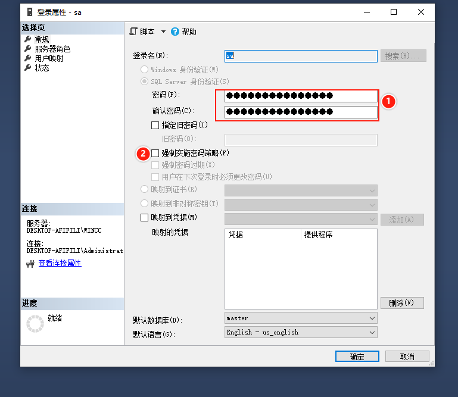
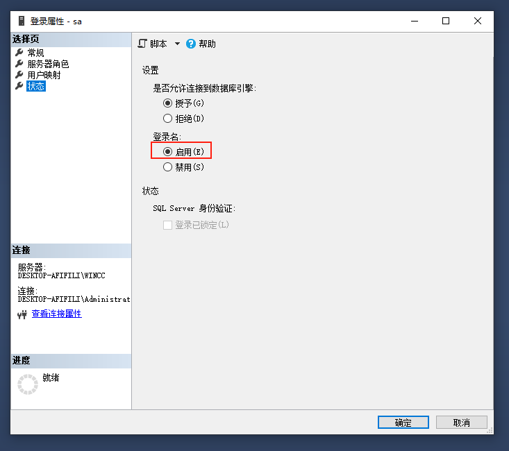
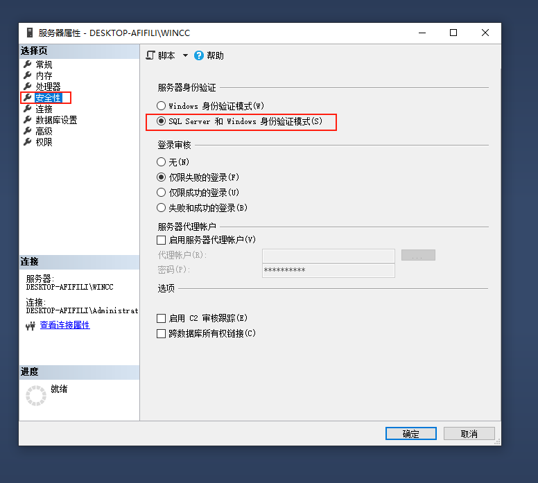

# WinCC 自帶SQL Server的基本配置

## 安装sqlserver management studio

wincc7.5安装的时候，只安装了数据库没有安装ssms，所以需要百度搜索下载sql server managemen studio进行下载，然后单独安装

## 配置1433端口号生效

- 打开sql server configuration manager
- 找到TCP/IP这个选项，右击属性
- 端口号那里本来是空白的，现在输入1433

## 启用sa及配置密码

1. 先用windows用户登录SSMS

   

2. 如图

3. 输入密码，取消勾选`强制实施密码密码策略`

4. 点击状态，登录名，启用

5. 

6. 

