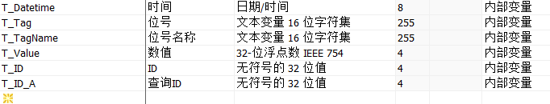
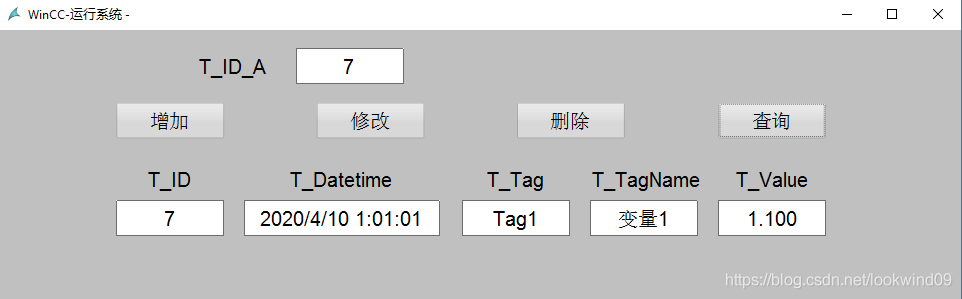

# 增删改查

[原文链接](https://blog.csdn.net/lookwind09/article/details/105608169)

# 前言

这篇文件简单介绍通过WinCC使用VBS对数据库增改删查询的功能实现，实际项目中要根据需要进行代码扩展和数据库建表，比如数据的检验、数据库表的[主键](https://so.csdn.net/so/search?q=主键&spm=1001.2101.3001.7020)和索引等。

# 1. 环境

**系统：**Windows 10 LTSB2016

**WinCC:** V7.5

**数据库:** SQL Server2016(WinCC自带）

# 2. 准备

## **2.1 变量管理** 

在WinCC变量管理建立6个内部变量（项目中根据需要使用PLC的变量，这里是方便测试）。



图2.1

## **2.2 图形编辑器** 

新建PDL，在PDL上添加4个按钮和6个IO域（输入输出域）。



图2.2

## **2.3 数据库** 

数据库表DataTableTest字段及类型。

##  

# 3. 增改删查询功能

## **3.1 说明** 

### 3.1.1 数据库连接说明

|          | **说明**      | **备注**                                                 |
| -------- | ------------- | -------------------------------------------------------- |
| 数据库名 | Test          |                                                          |
| 表名     | DataTableTest |                                                          |
| 用户名   | sa            |                                                          |
| 密码     | 123456        |                                                          |
| 数据源   | WSES\WINCC    | **WSES是我的计算机名，根据实际修改，也可以使用IP\WINCC** |

###  3.1.2 功能说明

增加：把数据写入到数据库（insert)。

修改：修改T_ID显示的数据(update)。

删除：删除T_ID显示的数据(delete)。

查询：查询T_ID_A的数据(select)。

注：insert、update、delete、select是PL/SQL对数据库操作的关键字，SQL Server、MySQL、Oracle等均支持。

**PS:在后面的代码中重点关注insert、update、delete、select的语句。**

## **3.2 增加功能的代码** 

重点：注释中的数据库语句

```vbscript
Dim objconnection,objRecordset,objcommand,strsql


Dim Datetime,Tag,TagName,Value


 


Datetime = HMIRuntime.Tags("T_Datetime").Read


Tag = HMIRuntime.Tags("T_Tag").Read


TagName = HMIRuntime.Tags("T_TagName").Read


Value = HMIRuntime.Tags("T_Value").Read


 


'打开数据库 


Set  objconnection=CreateObject("ADODB.connection")


     objconnection.connectionstring="Provider=SQLOLEDB.1;Password=123456;Persist Security Info=True;User ID=sa;Initial Catalog=Test;;Data Source=WSES\WINCC;"   


     objconnection.open


Set  objcommand=CreateObject("ADODB.command")


Set  objRecordset=CreateObject("ADODB.Recordset")


 


 


'数据库语句


strsql = "INSERT INTO [Test].[dbo].[DataTableTest] ([Datetime], [Tag], [TagName], [Value])" 


strsql = strsql & " VALUES ('" & Datetime & "', '" & Tag &"', '" & TagName & "', '" & Value & "')"


 


Msgbox "增加完成"


     objcommand.activeconnection=objconnection


     objcommand.commandtext=strsql


Set  objRecordset=objCommand.Execute


 


 


'关闭数据库


 Set objcommand=Nothing


     objconnection.close


 Set objconnection=Nothing


 Set objRecordset=Nothing
```

## **3.3 修改功能的代码** 

```vbscript
Dim objconnection,objRecordset,objcommand,strsql


Dim ID,Datetime,Tag,TagName,Value	'定义变量


 


'把WinCC的变量传递给本程序内的变量


ID = HMIRuntime.Tags("T_ID").Read


Datetime = HMIRuntime.Tags("T_Datetime").Read


Tag = HMIRuntime.Tags("T_Tag").Read


TagName = HMIRuntime.Tags("T_TagName").Read


Value = HMIRuntime.Tags("T_Value").Read


 


'打开数据库 


Set  objconnection=CreateObject("ADODB.connection")


     objconnection.connectionstring="Provider=SQLOLEDB.1;Password=123456;Persist Security Info=True;User ID=sa;Initial Catalog=Test;;Data Source=WSES\WINCC;"   


     objconnection.open


Set  objcommand=CreateObject("ADODB.command")


Set  objRecordset=CreateObject("ADODB.Recordset")


 


 


 


'数据库更新语句


strsql ="UPDATE [Test].[dbo].[DataTableTest] SET [Datetime]= '" & Datetime &"', [Tag] = '" & Tag & "', [TagName] = '" & TagName & "', [Value] = " & Value & " WHERE ([ID] = " & ID & ")" 


 


MsgBox "修改完成"


 


     objcommand.activeconnection=objconnection


     objcommand.commandtext=strsql


Set  objRecordset=objCommand.Execute


	


'关闭数据库


 Set objcommand=Nothing


     objconnection.close


 Set objconnection=Nothing


 Set objRecordset=Nothing
```

## **3.4 删除功能的代码** 

```vbscript
Dim objconnection,objRecordset,objcommand,strsql


Dim ID,recordsCount


 


ID = HMIRuntime.Tags("T_ID").Read


 


'打开数据库 


Set  objconnection=CreateObject("ADODB.connection")


     objconnection.connectionstring="Provider=SQLOLEDB.1;Password=123456;Persist Security Info=True;User ID=sa;Initial Catalog=Test;;Data Source=WSES\WINCC;"   


     objconnection.open


Set  objcommand=CreateObject("ADODB.command")


Set  objRecordset=CreateObject("ADODB.Recordset")


 


'数据库查询语句


strsql ="SELECT * FROM [Test].[dbo].[DataTableTest] WHERE ID = " & ID


 


'查询记录数


objRecordset.Open strsql,objconnection,1,3


recordsCount = objRecordset.RecordCount


 


'数据库删除数据


If (recordsCount > 0) Then 


	strsql ="DELETE FROM [Test].[dbo].[DataTableTest] WHERE [ID] = " & ID 


	MsgBOX "删除完成"


Else 


	Msgbox "此条数据已删除"


End If 


 


     objcommand.activeconnection=objconnection


     objcommand.commandtext=strsql


Set  objRecordset=objCommand.Execute


 


'关闭数据库


 Set objcommand=Nothing


     objconnection.close


 Set objconnection=Nothing


 Set objRecordset=Nothing
```

## **3.5 查询功能的代码** 

```vbscript
Dim objconnection,objRecordset,objcommand,strsql


Dim T_ID_A


 


T_ID_A = HMIRuntime.Tags("T_ID_A").read


 


'打开数据库 


Set  objconnection=CreateObject("ADODB.connection")


     objconnection.connectionstring="Provider=SQLOLEDB.1;Password=123456;Persist Security Info=True;User ID=sa;Initial Catalog=Test;Data Source=WSES\WINCC;"   


     objconnection.open


Set  objcommand=CreateObject("ADODB.command")


Set  objRecordset=CreateObject("ADODB.Recordset")


 


'数据库查询语句


strsql ="SELECT [ID],[Datetime],[Tag],[TagName],[Value]  FROM [Test].[dbo].[DataTableTest]"


strsql = strsql & " WHERE ID = '" & T_ID_A & "'"


 


     objcommand.activeconnection=objconnection


     objcommand.commandtext=strsql


Set  objRecordset=objCommand.Execute


 


'查询的数据传送给WinCC的内部变量


HMIRuntime.Tags("T_ID").write objRecordset.fields("ID").value


HMIRuntime.Tags("T_Datetime").write objRecordset.fields("Datetime").value


HMIRuntime.Tags("T_Tag").write objRecordset.fields("Tag").value


HMIRuntime.Tags("T_TagName").write objRecordset.fields("TagName").value


HMIRuntime.Tags("T_Value").write objRecordset.fields("Value").value


 


 


'关闭数据库


 Set objcommand=Nothing


     objconnection.close


 Set objconnection=Nothing


 Set objRecordset=Nothing
```

 