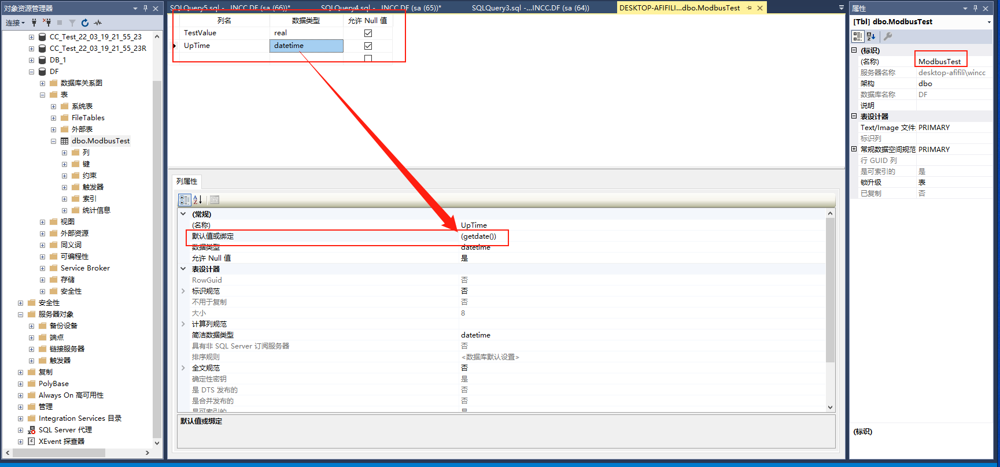
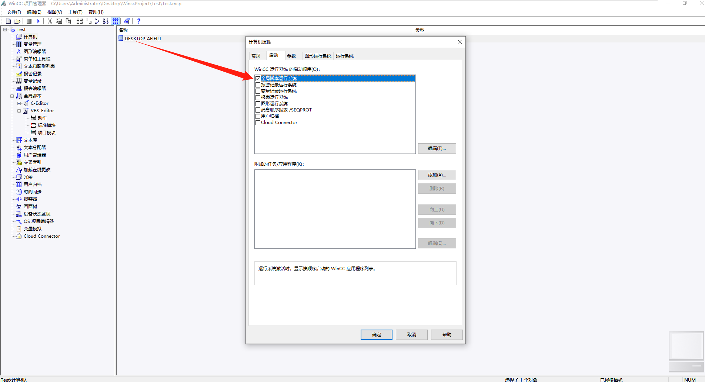
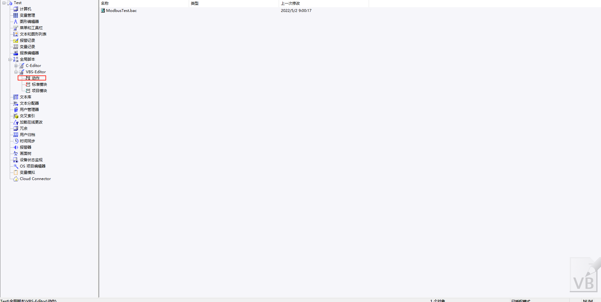
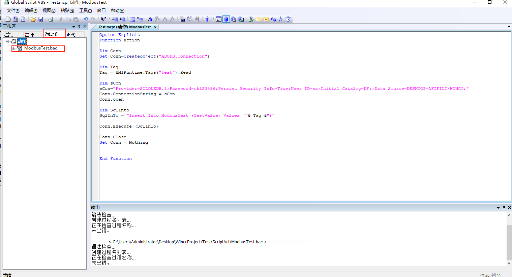
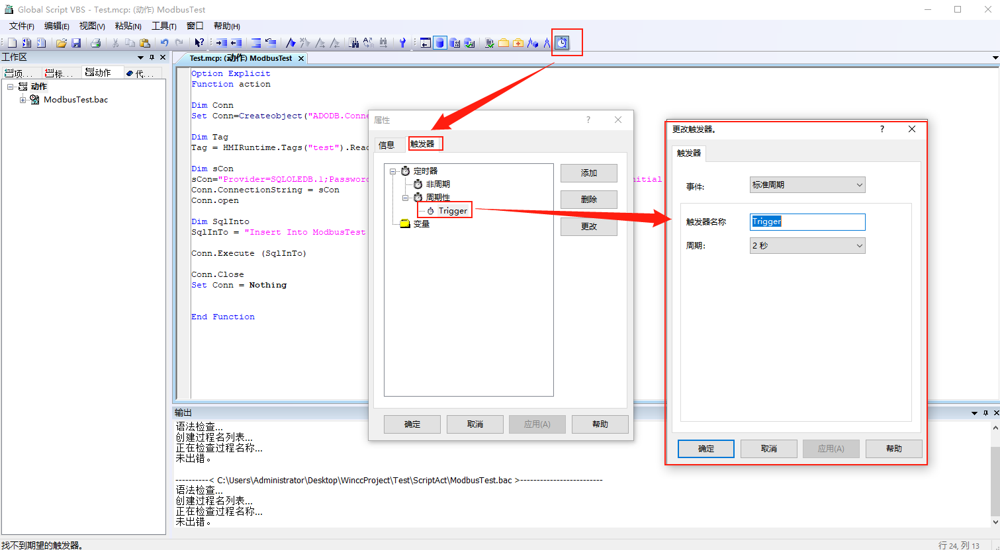

# 点位定时归档到sql server

[wincc读写sql server示例](https://blog.csdn.net/qq_18671205/article/details/85250226?ops_request_misc=%257B%2522request%255Fid%2522%253A%2522165026348116782184679915%2522%252C%2522scm%2522%253A%252220140713.130102334..%2522%257D&request_id=165026348116782184679915&biz_id=0&utm_medium=distribute.pc_search_result.none-task-blog-2~all~baidu_landing_v2~default-2-85250226.142^v9^pc_search_result_control_group,157^v4^control&utm_term=wincc+%E6%95%B0%E6%8D%AE%E5%BA%93&spm=1018.2226.3001.4187)

[如何和数据库建立连接](https://blog.csdn.net/u010692765/article/details/50955531?ops_request_misc=%257B%2522request%255Fid%2522%253A%2522165026348116782184679915%2522%252C%2522scm%2522%253A%252220140713.130102334..%2522%257D&request_id=165026348116782184679915&biz_id=0&utm_medium=distribute.pc_search_result.none-task-blog-2~all~baidu_landing_v2~default-3-50955531.142^v9^pc_search_result_control_group,157^v4^control&utm_term=wincc+%E6%95%B0%E6%8D%AE%E5%BA%93&spm=1018.2226.3001.4187)

[Wincc高级应用数据库操作-B站视频](https://www.bilibili.com/video/BV19L4y1u7ib?p=32&spm_id_from=pageDriver)

[wincc 数据库增删改查](https://blog.csdn.net/lookwind09/article/details/105608169)

## 新建数据库


## 新建表



## 启动全局脚本



## 创建全局脚本





```vbscript
Option Explicit
Function action

Dim Conn
Set Conn=Createobject("ADODB.Connection")

Dim Tag
Tag = HMIRuntime.Tags("test").Read 

Dim sCon
sCon="Provider=SQLOLEDB.1;Password=ck123456;Persist Security Info=True;User ID=sa;Initial Catalog=DF;;Data Source=DESKTOP-AFIFILI\WINCC;"
Conn.ConnectionString = sCon
Conn.open

Dim SqlInto
SqlInTo = "Insert Into ModbusTest (TestValue) Values ("& Tag &")"

Conn.Execute (SqlInTo)

Conn.Close
Set Conn = Nothing


End Function
```

## 定时触发器设置



