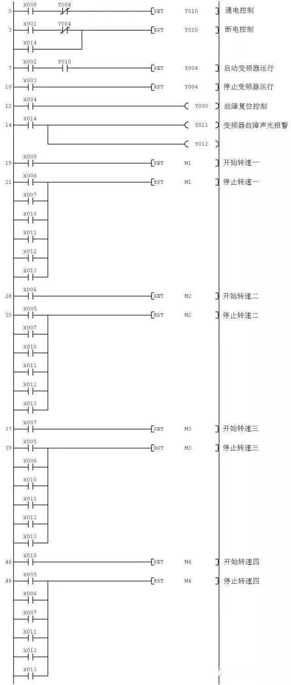

# 图解PLC与变频器通讯接线（超详细） 

[原文](https://www.sohu.com/a/454125520_715708)

plc与变频器两者是一种包含与被包含的关系，PLC与变频器都可以完成一些特定的指令，用来控制电机马达，PLC是一种程序输入执行硬件，变频器则是其中之一。

但是PLC的涵盖范围又比变频器大，还可以用来控制更多的东西，应用领域更广，性能更强大，当然PLC的控制精度也更大。变频器无法进行编程，改变电源的频率、电压等参数，它的输出频率可以设为固定值，也可以由PLC动态控制。

plc是可以编程序的，用来控制电气元件或完成功能、通信等任务。

PLC与变频器之间通信需要遵循通用的串行接口协议（USS），按照串行总线的主从通信原理来确定访问的方法。总线上可以连接一个主站和最多31个从站，主站根据通信报文中的地址字符来选择要传输数据的从站，在主站没有要求它进行通信时，从站本身不能首先发送数据，各个从站之间也不能直接进行信息的传输。

**PLC基本结构图**

PLC可编程控制器的存储器可以分为系统程序存储器、用户程序存储器及工作数据存储器等三种。

1、系统程序存储器

系统程序存储器用来存放由可编程控制器生产厂家编写的系统程序，并固化在ROM内，用户不能直接更改。系统程序质量的好坏，很大程度上决定了PLC的性能。

其内容主要包括三部分：第一部分为系统管理程序，它主要控制可编程控制器的运行，使整个可编程控制器按部就班地工作，第二部分为用户指令解释程序，通过用户指令解释程序，将可编程控制器的编程语言变为机器语言指令，再由CPU执行这些指令；第三部分为标准程序模块与系统调用程序。

2、用户程序存储器

根据控制要求而编制的应用程序称为用户程序。用户程序存储器用来存放用户针对具体控制任务，用规定的可编程控制器编程语言编写的各种用户程序。

目前较先进的可编程控制器采用可随时读写的快闪存储器作为用户程序存储器，快闪存储器不需后备电池，掉电视数据也不会丢失。

3、工作数据存储器

工作数据存储器用来存储工作数据，既用户程序中使用的ON/OFF状态、数值数据等。在工作数据区中开辟有元件映像寄存器和数据表。其中元件映像寄存器用来存储开关量、输出状态以及定时器、计数器、辅助继电器等内部器件的ON/OFF状态。数据表用来存放各种数据，它存储用户程序执行时的某些可变参数值及A/D转换得到的数字量和数字运算的结果等。

变频器基本结构图

变频器是把工频电源（50Hz或60Hz）变换成各种频率的交流电源，以实现电机的变速运行的设备，其中控制电路完成对主电路的控制，整流电路将交流电变换成直流电，直流中间电路对整流电路的输出进行平滑滤波，逆变电路将直流电再逆变成交流电。对于如矢量控制变频器这种需要大量运算的变频器来说，有时还需要一个进行转矩计算的CPU以及一些相应的电路。

plc与变频器一般有三种连接方法

①利用PLC的模拟量输出模块控制变频器PLC的模拟量输出模块输出0～5V电压信号或4～20mA电流信号，作为变频器的模拟量输入信号，控制变频器的输出频率。这种控制方式接线简单，但需要选择与变频器输入阻抗匹配的PLC输出模块，且PLC的模拟量输出模块价格较为昂贵，此外还需采取分压措施使变频器适应PLC的电压信号范围，在连接时注意将布线分开，保证主电路一侧的噪声不传至控制电路。

②利用PLC的开关量输出控制变频器。PLC的开关输出量一般可以与变频器的开关量输入端直接相连。这种控制方式的接线简单，抗干扰能力强。利用PLC的开关量输出可以控制变频器的启动／停止、正／反转、点动、转速和加减时间等，能实现较为复杂的控制要求，但只能有级调速。

使用继电器触点进行连接时，有时存在因接触不良而误操作现象。使用晶体管进行连接时，则需要考虑晶体管自身的电压、电流容量等因素，保证系统的可靠性。另外，在设计变频器的输入信号电路时，还应该注意到输入信号电路连接不当，有时也会造成变频器的误动作。例如，当输入信号电路采用继电器等感性负载，继电器开闭时，产生的浪涌电流带来的噪声有可能引起变频器的误动作，应尽量避免。

③PLC与RS-485通信接口的连接。所有的标准西门子变频器都有一个RS-485串行接口（有的也提供RS-232接口），采用双线连接，其设计标准适用于工业环境的应用对象。单一的RS-485链路最多可以连接30台变频器，而且根据各变频器的地址或采用广播信息，都可以找到需要通信的变频器。链路中需要有一个主控制器（主站），而各个变频器则是从属的控制对象（从站）。

PLC的变频器控制电机正反转接线图

1．按接线图将线连好后，启动电源，准备设置变频器各参数。

2．按“MODE”键进入参数设置模式，将Pr.79设置为“2”：外部操作模式，启动信号由外部端子（STF、STR）输入，转速调节由外部端子（2、5之间、4、5之间、多端速）输入。

3．连续按“MODE”按钮，退出参数设置模式。

4．按下正转按钮，电动机正转启动运行。

5．按下停止按钮，电动机停止。

6．按下反转按钮，电动机反转 启动运行。

7．按下停止按钮，电动机停止。

\8. 若在电动正转时按下反转按钮，电动机先停止后反转；反之，若在电动机反转时按下正转按钮，电动机先停止后正转。

plc与变频器的接线图

**PlC和变频器通讯方式**

1、PLC的开关量信号控制变频器

PLC（MR型或MT型）的输出点、COM点直接与变频器的STF（正转启动）、RH（高速）、RM（中速）、RL（低速）、输入端SG等端口分别相连。PLC可以通过程序控制变频器的启动、停止、复位；也可以控制变频器高速、中速、低速端子的不同组合实现多段速度运行。但是，因为它是采用开关量来实施控制的，其调速曲线不是一条连续平滑的曲线，也无法实现精细的速度调节。

2、PLC的模拟量信号控制变频器

硬件：FX1N型、FX2N型PLC主机，配置1路简易型的FX1N-1DA-BD扩展模拟量输出板；或模拟量输入输出混合模块FX0N-3A；或两路输出的FX2N-2DA；或四路输出的FX2N-4DA模块等。优点：PLC程序编制简单方便，调速曲线平滑连续、工作稳定。

缺点：在大规模生产线中，控制电缆较长，尤其是DA模块采用电压信号输出时，线路有较大的电压降，影响了系统的稳定性和可靠性。

3、 PLC采用RS-485通讯方法控制变频器

这是使用得最为普遍的一种方法，PLC采用RS串行通讯指令编程。优点：硬件简单、造价最低，可控制32台变频器。缺点：编程工作量较大。

4、 PLC采用RS-485的Modbus-RTU通讯方法控制变频器

三菱新型F700系列变频器使用RS-485端子利用Modbus-RTU协议与PLC进行通讯。优点：Modbus通讯方式的PLC编程比RS-485无协议方式要简单便捷。缺点：PLC编程工作量仍然较大。

5、 PLC采用现场总线方式控制变频器

三菱变频器可内置各种类型的通讯选件，如用于CC-Link现场总线的FR-A5NC选件；用于Profibus DP现场总线的FR-A5AP（A）选件；用于DeviceNet现场总线的FR-A5ND选件等等。三菱FX系列PLC有对应的通讯接口模块与之对接。

优点：速度快、距离远、效率高、工作稳定、编程简单、可连接变频器数量多。缺点：造价较高。

6、采用扩展存储器

优点：造价低廉、易学易用、性能可靠 缺点：只能用于不多于8台变频器的系统。

**PLC和变频器通讯接线图**

三菱PLC控制台达变频器案例分析

在不外接控制器（如PLC）的情况下，直接操作变频器有三种方式：

①操作面板上的按键；

②操作接线端子连接的部件（如按钮和电位器）；

③复合操作（如操作面板设置频率，操作接线端子连接的按钮进行启/停控制）。为了操作方便和充分利用变频器，也可以采用PLC来控制变频器。

PLC控制变频器有三种基本方式：

①以开关量方式控制；

②以模拟量方式控制；

③以RS485通信方式控制。

PLC以开关量方式控制变频器的硬件连接

变频器有很多开关量端子，如正转、反转和多档转速控制端子等，不使用PLC时，只要给这些端子接上开关就能对变频器进行正转、反转和多档转速控制。当使用PLC控制变频器时，若PLC是以开关量方式对变频进行控制，需要将PLC的开关量输出端子与变频器的开关量输入端子连接起来，为了检测变频器某些状态，同时可以将变频器的开关量输出端子与PLC的开关量输入端子连接起来。

PLC以开关量方式控制变频器的硬件连接如下图所示。当PLC内部程序运行使Y001端子内部硬触点闭合时，相当于变频器的STF端子外部开关闭合，STF端子输入为ON，变频器启动电动机正转，调节10、2、5端子所接电位器可以改变端子2的输入电压，从而改变变频器输出电源的频率，进而改变电动机的转速。如果变频器内部出现异常时，A、C端子之间的内部触点闭合，相当于PLC的X001端子外部开关闭合，X001端子输入为ON。

PLC以模拟量方式控制变频器的硬件连接

变频器有一些电压和电流模拟量输入端子，改变这些端子的电压或电流输入值可以改变电动机的转速，如果将这些端子与PLC的模拟量输出端子连接，就可以利用PLC控制变频器来调节电动机的转速。模拟量是一种连续变化的量，利用模拟量控制功能可以使电动机的转速连续变化（无级变速）

PLC以模拟量方式控制变频器的硬件连接如下图所示，由于三菱FX2N-32MR型PLC无模拟量输出功能，需要给它连接模拟量输出模块（如FX2N-4DA），再将模拟量输出模块的输出端子与变频器的模拟量输入端子连接。当变频器的STF端子外部开关闭合时，该端子输入为ON，变频器启动电动机正转，PLC内部程序运行时产生的数字量数据通过连接电缆送到模拟量输出模块（DA模块），由其转换成0～5V或0～10V范围内的电压（模拟量）送到变频器2、5端子，控制变频器输出电源的频率，进而控制电动机的转速，如果DA模块输出到变频器2、5端子的电压发生变化，变频器输出电源频率也会变化，电动机转速就会变化。

PLC在以模拟量方式控制变频器的模拟量输入端子时，也可同时用开关量方式控制变频器的开关量输入端子。

PLC以RS485通信方式控制变频器的硬件连接

PLC以开关量方式控制变频器时，需要占用较多的输出端子去连接变频器相应功能的输入端子，才能对变频器进行正转、反转和停止等控制；PLC以模拟量方式控制变频器时，需要使用DA模块才能对变频器进行频率调速控制。如果PLC以RS485通信方式控制变频器，只需一根RS485通信电缆（内含5根芯线），直接将各种控制和调频命令送给变频器，变频器根据PLC通过RS485通信电缆送来的指令就能执行相应的功能控制。

RS485通信是目前工业控制广泛采用的一种通信方式，具有较强的抗干扰能力，其通信距离可达几十米至上千米。采用RS485通信不但可以将两台设备连接起来进行通信，还可以将多台设备（最多可并联32台设备）连接起来构成分布式系统，进行相互通信。

1.变频器的RS485通信口

三菱FR500系列变频器有一个用于连接操作面板的PU口，该接口可用作RS485通信口，在使用RS485方式与其他设备通信时，需要将操作面板插头（RJ45插头）从PU口拔出，再将RS485通信电缆的一端插入PU口，通信电缆另一端连接PLC或其他设备。三菱FR500系列变频器PU口外形及各引脚功能说明如下图所示。

三菱FR500系列变频器只有一个RS485通信口（PU口），面板操作和RS485通信不能同时进行，而三菱FR700系列变频器除了有一个PU接口外，还单独配备了一个RS485通信口（接线排），专用于进行RS485通信。三菱FR700系列变频器RS485通信口外形及各脚功能说明如下图所示，通信口的每个功能端子都有2个，一个接上一台RS485通信设备，另一个端子接下一台RS485通信设备，若无下一台设备，应将终端电阻开关拨至“100Ω”侧。

2.PLC的RS485通信口

三菱FX PLC一般不带RS485通信口，如果要与变频器进行RS485通信，须给PLC安装FX2N-485BD通信板。485BD通信板的外形和端子如下图(a)所示，通信板的安装方法如下图（b）所示。

(a)外形

(b)安装方法

3.变频器与PLC的RS485通信连接

(1)单台变频器与PLC的RS485通信连接

单台变频器与PLC的RS485通信连接如下图所示，两者在连接时，一台设备的发送端子（+-）应分别与另一台设备的接收端子（+-）连接，接收端子（+-）应分别与另一台设备的发送端子（+-）连接。

(2)多台变频器与PLC的RS485通信连接

多台变频器与PLC的RS485通信连接如下图所示，它可以实现一台PLC控制多台变频器的运行。

PLC控制变频器驱动电动机正反转的电路、程序及参数设置

1.PLC与变频器的硬件连接线路图

PLC以开关量方式控制变频器驱动电动机正反转的线路图如下图所示。

2.变频器的参数设置

在使用PLC控制变频器时，需要对变频器进行有关参数设置，具体见下表。

3.编写PLC控制程序

变频器有关参数设置好后，还要用编程软件编写相应的PLC控制程序并下载给PLC。PLC控制变频器驱动电动机正反转的PLC程序如下图所示。

PLC控制变频器驱动电动机多档转速运行的电路、程序及参数设置

变频器可以连续调速，也可以分档调速，FR-500系列变频器有RH（高速）、RM（中速）和RL（低速）三个控制端子，通过这三个端子的组合输入，可以实现7档转速控制。如果将PLC的输出端子与变频器这些端子连接，就可以用PLC控制变频器来驱动电动机多档转速运行。

1.PLC与变频器的硬件连接线路图

PLC以开关量方式控制变频器驱动电动机多档转速运行的线路图如下图所示。

3.编写PLC控制程序

PLC以开关量方式控制变频器驱动电动机多档转速运行的PLC程序如下图。

