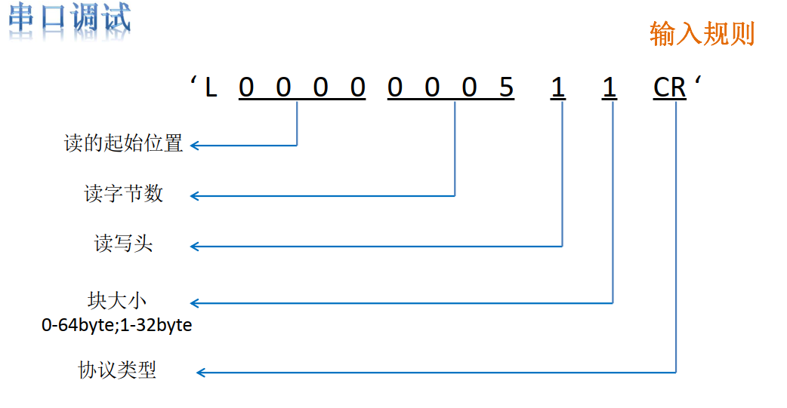
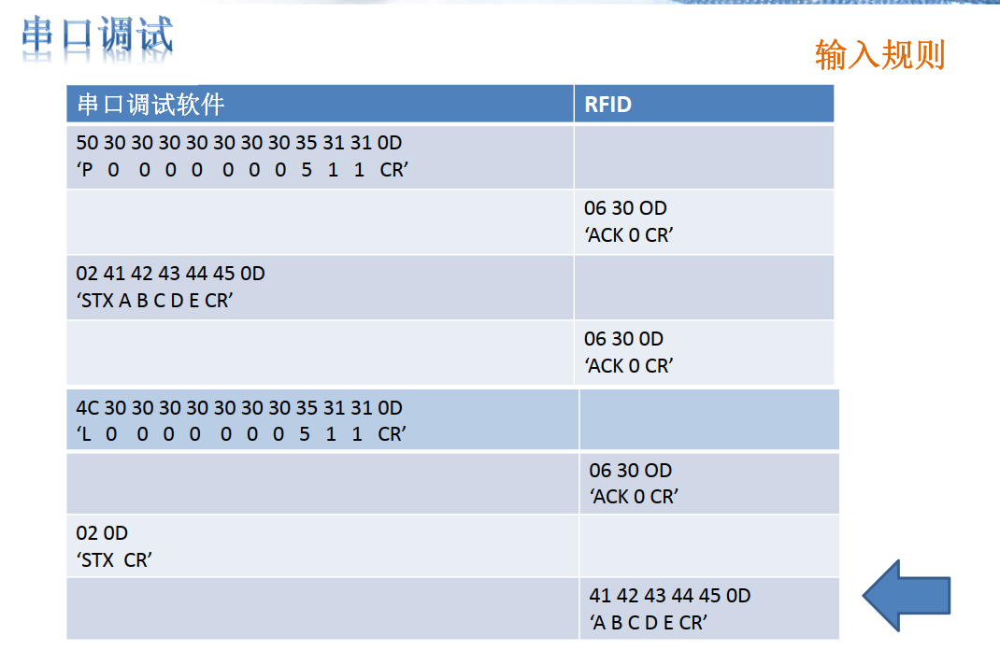
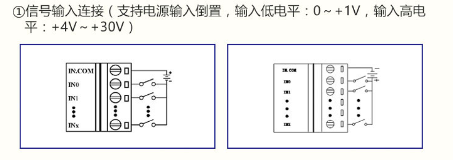
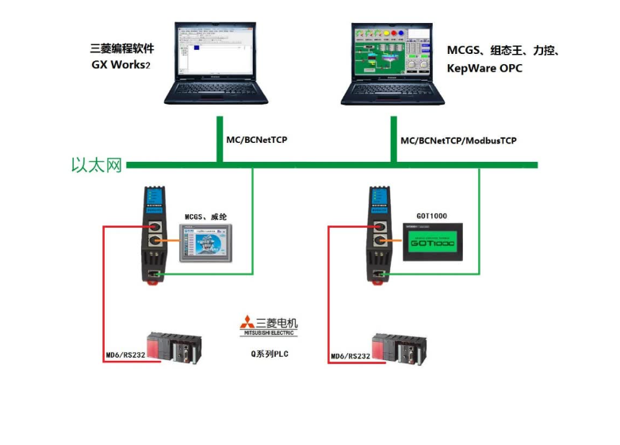
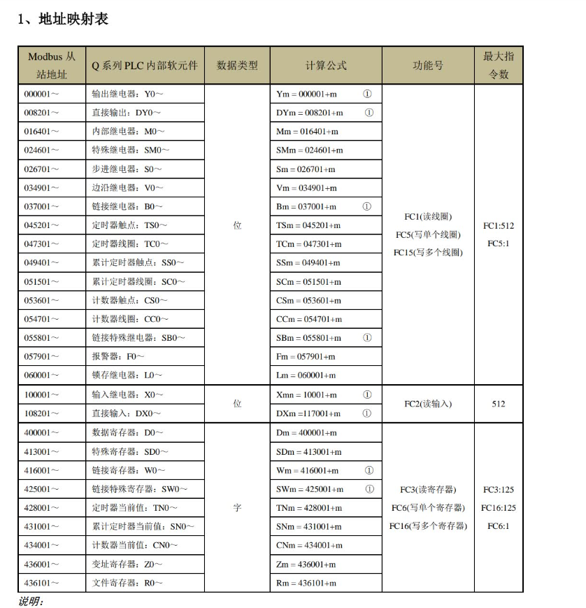

# 设备对接分享

## 1 仪器仪表串口设备

​	仪器仪表设备，我接触的主要为燃气表、电表、蒸汽表、水表、流量计这类的设备，其中对接方式主要为标准的ModbusRtu的协议。

### 1.1 多设备接线

针对这类的设备接下图如下：

### 1.2 485转USB

### 1.3 ModScan测试软件

测试的时候，可以采用ModScan软件进行测试：

### 1.4 仪表通讯点位示例（天然气表）

| 属性 | 地址     | 寄存器长度 | 数据类型 | 说明                                                         |
| ---- | -------- | ---------- | -------- | ------------------------------------------------------------ |
| R    | 40001-2  | 2          | SINGLE   | 介质温度(℃)                                                  |
| R    | 40003-4  | 2          | SINGLE   | 介质压力（kPa）                                              |
| R    | 40005-6  | 2          | SINGLE   | 传感器频率（Hz）                                             |
| R    | 40007-8  | 2          | SINGLE   | 每秒瞬时流量（m3/s），解析出来的值要乘以3600才是仪表显示值   |
| R    | 40009-10 | 2          | SINGLE   | 累计流量的百位以上                                           |
| R    | 40011-12 | 2          | SINGLE   | 累计流量的百位以下                                           |
| R    | 40013-14 | 2          | UINT     | 上限报警状态     0001－工况流量;   0004－标况流量;  0010－压力;  0040－温度; |
| R    | 40015-16 | 2          | UINT     | 下限报警状态     0001－工况流量;   0004－标况流量;  0010－压力;  0040－温度; |
| R    | 40017-18 | 2          | SINGLE   | 4－20mA电流输出值（mA）                                      |
| R    | 40019-20 | 2          | 备用     |                                                              |

### 1.5 ModScan配置示例

### 1.6 非标准协议

这类需要做定制化开发，如下图为某厂商的RFID通讯握手示例，这种就需要做定制化开发。

## 2 IO设备

这部分需要查要接的电气元件的电气说明书，然后再做选型。

### 2.1 模拟量信号：4到20毫安、0到20毫安、0到5V、0到10V

### 2.2 数字量信号

数字量信号，主要是开关量这些，用来测试电路是否通断。

### 2.3 电阻信号

像温度传感器，PT100，就可以根据测量到的电阻值，进行换算出温度。

## 3 PLC设备

PLC类设备，主要介绍几种采集思路。

### 3.1 PLC内部做ModbusTCP或者ModbusRTU串口服务

我们拿西门子1500举例，在工控领域对接的时候，可以根据约定好控制信号或转发信号，采集设备作为客户端，PLC作为服务端做通讯。

优点：稳定、可靠、对所有的PLC都适用；

缺点：需要做PLC程序、厂家改动较大；

### 3.2 在外部加模块，将PLC内存区映射出去

三菱FX或者Q系列PLC通过在外部加模块的方式，模块会将PLC内部的寄存器映射为标准Modbus的地址，网关或者上位机通过实现Modbus客户端即可实现数据采集。

下面是一个三菱Q系列的PLC的模块拓展图和内存区的映射关系：

### 3.3 其他

其他类的PLC，还是根据大家常规的配置网关或者自己开发驱动进行采集。

## 4 数据库类

### 4.1 实时表

有些Scada系统或者本地工控机带的中控系统，会有设备相关的表，可以通过这种做数采，如染色剂DTR系统。下面是表大概内容举例：

| DeviceID | DeviceName | RunState | Alarm | Temperature |
| -------- | ---------- | -------- | ----- | ----------- |
| Q16      | 设备16     | 1        | 0     | 56.8        |
| Q17      | 设备17     | 1        | 1     | 57.8        |
| Q18      | 设备18     | 0        | 0     | 51.8        |

### 4.2 历史表

有的系统会将设备运行的历史数据进行归档，比如每五秒归档一次，然后在同一个表中，类似于下面这种：

## 5 文件类

## 注塑机

## 机加

## 质检设备

## 独立控制器

## PLC破解

## PLC点位盲点

## 私有协议破解思路

## 网络

