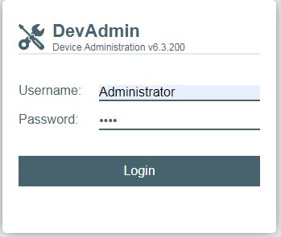
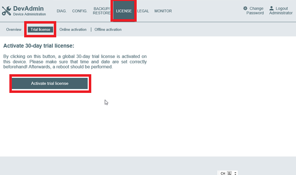
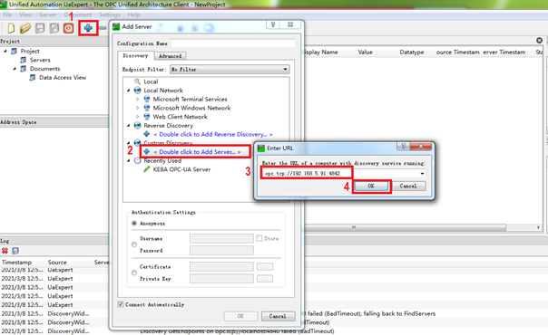
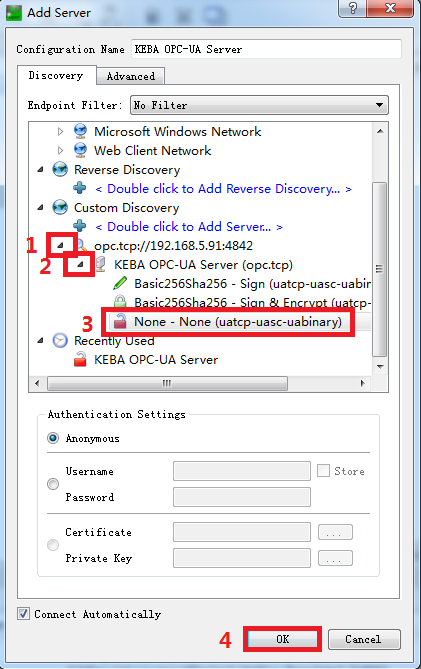
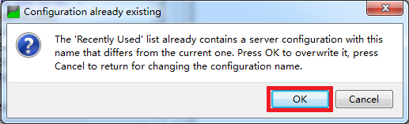
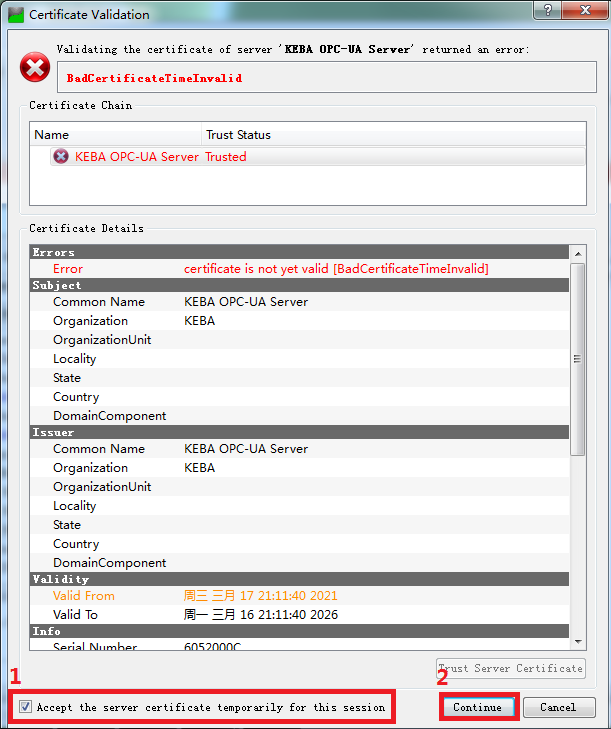
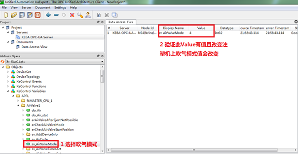

# 设备对接分享

## 1 仪器仪表串口设备

​	仪器仪表设备，我接触的主要为燃气表、电表、蒸汽表、水表、流量计这类的设备，其中对接方式主要为标准的ModbusRtu的协议。

### 1.1 多设备接线

针对这类的设备接下图如下：


### 1.2 485转USB


### 1.3 ModScan测试软件

测试的时候，可以采用ModScan软件进行测试：


### 1.4 仪表通讯点位示例（天然气表）

| 属性 | 地址     | 寄存器长度 | 数据类型 | 说明                                                         |
| ---- | -------- | ---------- | -------- | ------------------------------------------------------------ |
| R    | 40001-2  | 2          | SINGLE   | 介质温度(℃)                                                  |
| R    | 40003-4  | 2          | SINGLE   | 介质压力（kPa）                                              |
| R    | 40005-6  | 2          | SINGLE   | 传感器频率（Hz）                                             |
| R    | 40007-8  | 2          | SINGLE   | 每秒瞬时流量（m3/s），解析出来的值要乘以3600才是仪表显示值   |
| R    | 40009-10 | 2          | SINGLE   | 累计流量的百位以上                                           |
| R    | 40011-12 | 2          | SINGLE   | 累计流量的百位以下                                           |
| R    | 40013-14 | 2          | UINT     | 上限报警状态     0001－工况流量;   0004－标况流量;  0010－压力;  0040－温度; |
| R    | 40015-16 | 2          | UINT     | 下限报警状态     0001－工况流量;   0004－标况流量;  0010－压力;  0040－温度; |
| R    | 40017-18 | 2          | SINGLE   | 4－20mA电流输出值（mA）                                      |
| R    | 40019-20 | 2          | 备用     |                                                              |

### 1.5 ModScan配置示例


### 1.6 非标准协议

这类需要做定制化开发，如下图为某厂商的RFID通讯握手示例，这种就需要做定制化开发。


## 2 IO设备

这部分需要查要接的电气元件的电气说明书，然后再做选型。

### 2.1 模拟量信号：4到20毫安、0到20毫安、0到5V、0到10V


### 2.2 数字量信号

数字量信号，主要是开关量这些，用来测试电路是否通断。


### 2.3 电阻信号

像温度传感器，PT100，就可以根据测量到的电阻值，进行换算出温度。

## 3 PLC设备

PLC类设备，主要介绍几种采集思路。

### 3.1 PLC内部做ModbusTCP或者ModbusRTU串口服务

我们拿西门子1500举例，在工控领域对接的时候，可以根据约定好控制信号或转发信号，采集设备作为客户端，PLC作为服务端做通讯。

优点：稳定、可靠、对所有的PLC都适用；

缺点：需要做PLC程序、厂家改动较大；

### 3.2 在外部加模块，将PLC内存区映射出去

三菱FX或者Q系列PLC通过在外部加模块的方式，模块会将PLC内部的寄存器映射为标准Modbus的地址，网关或者上位机通过实现Modbus客户端即可实现数据采集。

下面是一个三菱Q系列的PLC的模块拓展图和内存区的映射关系：


### 3.3 其他

其他类的PLC，还是根据大家常规的配置网关或者自己开发驱动进行采集。

## 4 数据库类

### 4.1 实时表

有些Scada系统或者本地工控机带的中控系统，会有设备相关的表，可以通过这种做数采，如染色剂DTR系统。下面是表大概内容举例：

| DeviceID | DeviceName | RunState | Alarm | Temperature |
| -------- | ---------- | -------- | ----- | ----------- |
| Q16      | 设备16     | 1        | 0     | 56.8        |
| Q17      | 设备17     | 1        | 1     | 57.8        |
| Q18      | 设备18     | 0        | 0     | 51.8        |

### 4.2 历史表

有的系统会将设备运行的历史数据进行归档，比如每五秒归档一次，然后在同一个表中，类似于下面这种：

| DeviceId | TagName  | Value | CreateTime          |
| -------- | -------- | ----- | ------------------- |
| 1        | RunState | 1     | 2023-04-21 15:59:06 |
| 2        | RunState | 1     | 2023-04-21 15:59:06 |
| 1        | RunState | 1     | 2023-04-21 15:59:06 |
| 2        | RunState | 1     | 2023-04-21 15:59:06 |
| 2        | Alarm    | 0     | 2023-04-21 15:59:06 |
| 1        | RunState | 1     | 2023-04-21 15:59:06 |
| 1        | RunState | 1     | 2023-04-21 15:59:06 |
| 1        | Alarm    | 0     | 2023-04-21 15:59:06 |
| 1        | Alarm    | 0     | 2023-04-21 15:59:06 |

## 5 文件类

下面是一个松下贴片机的归档数据，每1S归档一次，采集的时候，根据需要读取对应节点下面的数据。

```ini
[Index]
Format=ProductReport
Version=1.0000
Machine=NPM
Date=2022/10/20,11:15:11
AuthorType=Machine
Author=
Diff=
MJSID="12862165+12862219-00-BOT-V3_0+V3-1"
Comment=""

[Information]
Stage=1
Lane=1
Serial=591816
SerialStatus=1
Code=""
BcrStatus=2
ProductID="1198"
Rev=71
PlanID=""
Output=3
LotName="12862165+12862219-00-BOT-V3_0-1031"
LotNumber=1
MasterWO=""
SubWO=""

[Dispenser]
Head NHAdd BLKCode BLKSerial UseN NozzleName BondID UseB BondLibName Dispense Priming PSRErr

[MountPickupFeeder]
BLKCode BLKSerial UseF PartsName FAdd FSAdd ReelID UseR Pickup PMiss RMiss DMiss MMiss HMiss TRSMiss Mount LName TGSerial Vendor PPIErr
"F930" "FA0430ABH329941" 0 "12887861-00" 20020 0 "" 0 1715 1 0 0 0 0 0 1712 "BYD" "" "" 0
"F930" "FA0430ABH329943" 0 "12887863-00" 20018 0 "" 0 1714 1 0 0 0 0 0 1712 "BYD" "" "" 0
"FB10" "FA0210ASF441485" 0 "10254426-00" 10014 1 "" 0 3425 1 0 0 0 0 0 3424 "BYD" "" "" 0
"FB10" "FA0210ASF449193" 0 "11797302-00" 10017 1 "" 0 1713 0 1 0 0 0 0 1712 "BYD" "" "" 0
"FB10" "FA0210ASF441510" 0 "10292445-00" 10015 1 "" 0 5136 0 0 0 0 0 0 5136 "BYD" "" "" 0
"FB10" "FA0210ASF441508" 0 "10529262-00" 10013 1 "" 0 3424 0 0 0 0 0 0 3424 "BYD" "" "" 0
"FB20" "FA0220ACH388168" 0 "12010761-00" 10012 0 "" 0 5137 1 0 0 0 0 0 5136 "BYD" "" "" 0
"FB10" "FA0210ASF441487" 0 "11565849-00" 10011 1 "" 0 3440 2 14 0 0 0 0 3424 "BYD" "" "" 0
"FB20" "FA0220ACH381446" 0 "12131031-00" 20024 0 "" 0 1712 0 0 0 0 0 0 1712 "BYD" "" "" 0
"FB20" "FA0220ACH381447" 0 "11924180-00" 20022 0 "" 0 1712 0 0 0 0 0 0 1712 "BYD" "" "" 0
"FB10" "FA0210ASF445597" 0 "10786381-00" 10016 1 "" 0 3405 0 0 0 0 0 0 3405 "BYD" "" "" 0
"" "" 0 "11633357-00" 21001 1 "" 0 322 2 0 0 0 0 0 320 "BYD" "" "" 0
"" "" 0 "11633357-00" 21002 1 "" 0 285 0 0 0 0 0 0 285 "BYD" "" "" 0
```

## 6 注塑

### 6.1 海天-keba控制器

6.1.1 安装UaExpert客户端


6.1.2 测试Licence激活

6.1.2.1 将PC与注塑机联网

6.1.2.2 打开PC上的浏览器（建议使用Google Chrome浏览器），在地址栏输入：https://192.168.5.91/webservice/（这里的IP是指实际联网的注塑机IP，本说明里面以此IP举例；部分浏览器可能限制访问，请点击高级继续访问）

6.1.2.3 出现DevAdmin登录画面，用户名：Administrator；密码：pass，点击login

​                               

6.1.2.4 点击Licence—Trial licence—Activate Trial license，完成测试licence的激活。（此licence有30天的试用时间）

 

6.1.2.5  **完成以上步骤后，请重启控制器（注塑机断电再上电）** 

6.1.3 UaExpert使用 

6.1.3.1 打开UaExpert，按下图所示操作添加需要访问的注塑机（第3步中所填内容：opc.tcp://192.168.5.91:4842，其中IP应为注塑机实际IP）

 

 

6.1.3.2 添加完注塑机后，按下图依次操作（过程中会出现的对话框，点击ok即可。）

 



6.1.3.3 点击OK会出现信任证书的画面，选择接受打钩，点击continue

 

6.1.3.4 连接成功后，在左侧变量栏点击KeControl Variables/APPL，选择其中一个变量，用鼠标选中，直接拖到中间数据观察窗口即可

 

## 7 机加

### 7.1 法兰克

法兰克的新的控制器（30i），可以通过连接CD38A口或者Slot1口，采用Focas2协议进行通讯。

```

```


## 质检设备

## 独立控制器

## PLC破解

## PLC点位盲点

根据PLC指示灯，做IO点采集

根据触摸屏情况

上载程序，分析

## 私有协议破解思路

## 网络

